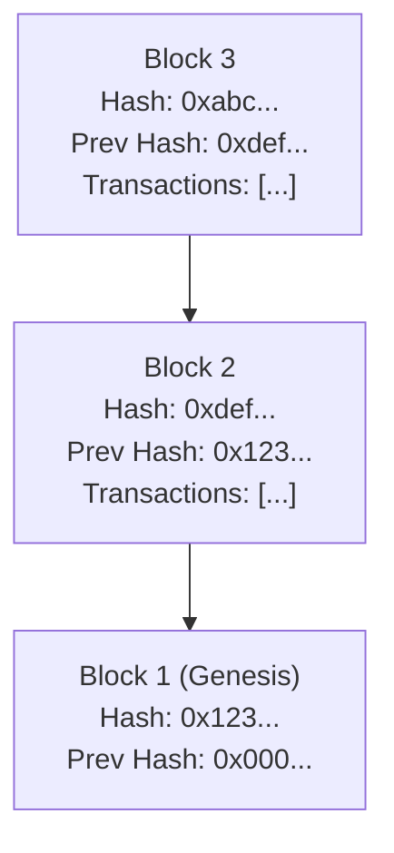
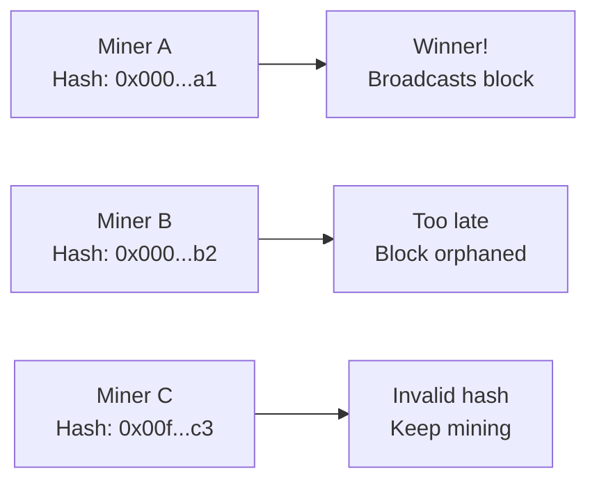
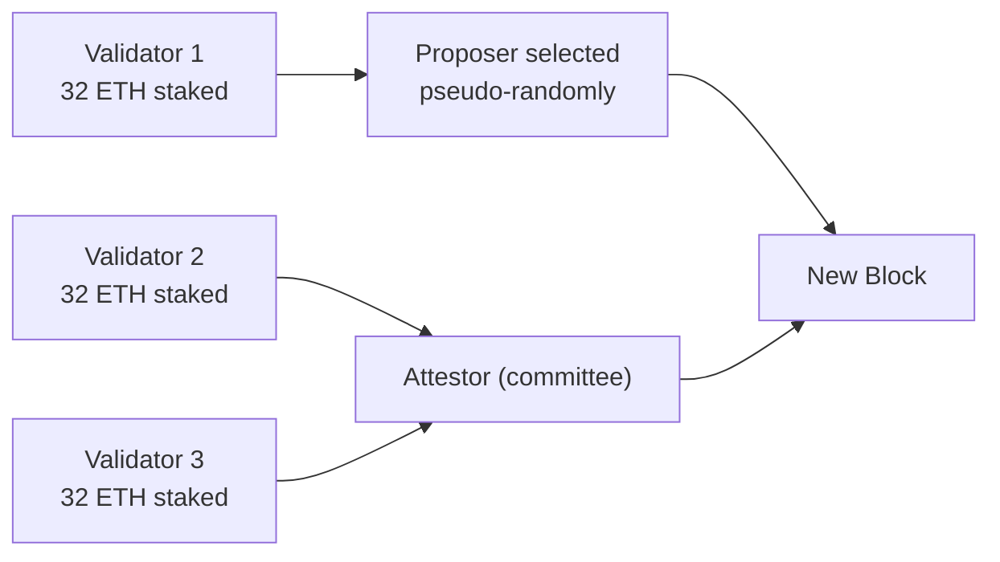
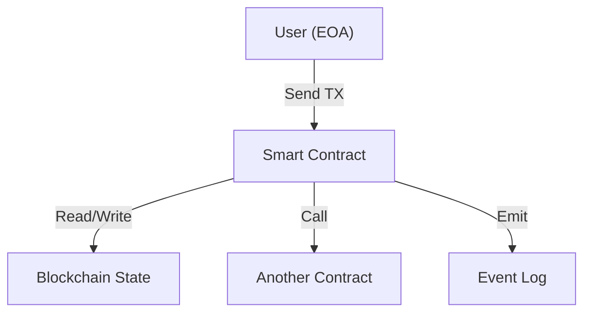

# Module 1 — What Is Blockchain?

> **Part 1 · Blockchain & Cryptography Foundations**

---

## Learning Objectives

After completing this module you will be able to:

1. Explain what a distributed ledger is and how it differs from a traditional database
2. Describe the structure of a block and how blocks are chained together
3. Compare Proof-of-Work (Bitcoin) with Proof-of-Stake (Ethereum)
4. Define what a smart contract is and why Ethereum was created
5. Use block explorers to inspect real transactions and blocks

---

## 1. The Big Picture: Why Blockchain Exists

### Analogy — The Shared Spreadsheet

Imagine 10,000 strangers all maintaining the **same spreadsheet**. Every time someone adds a row:

- Everyone gets a copy of the update
- Everyone verifies it follows the rules
- No single person can delete a row that others already have

That spreadsheet is a **distributed ledger** — the core idea behind blockchain.

### Key Properties

| Property | Traditional Database | Blockchain |
|----------|---------------------|------------|
| Control | Centralised (one org) | Decentralised (many nodes) |
| Mutability | CRUD — rows can change | Append-only (mostly immutable) |
| Trust model | Trust the operator | Trust the consensus protocol |
| Performance | Fast (ms) | Slower (seconds to minutes) |
| Censorship resistance | Low | High |

---

## 2. Blocks and the Chain

### What's Inside a Block?



Each block contains:

1. **Header**
   - Previous block hash (links the chain)
   - Timestamp
   - Nonce (PoW) or validator signature (PoS)
   - State root (the Merkle root of all accounts)
2. **Body** — a list of transactions
3. **Block number** — sequential integer

If you change a transaction in Block 2, its hash changes → Block 3's `prevHash` no longer matches → the chain breaks. This is why blockchains are **tamper-evident**.

---

## 3. Consensus — How Strangers Agree

### Proof of Work (Bitcoin)



- Miners compete to find a nonce such that `hash(block) < target`
- First to find it broadcasts the block; others verify
- Energy-intensive but battle-tested since 2009

### Proof of Stake (Ethereum, since Sep 2022 — "The Merge")



- Validators stake 32 ETH as collateral
- A proposer is selected each slot (~12 seconds) to build a block
- A committee of validators **attests** (votes) that the block is valid
- Misbehaving validators get **slashed** (lose staked ETH)
- ~99.95% less energy than PoW

---

## 4. Bitcoin vs. Ethereum

| Feature | Bitcoin | Ethereum |
|---------|---------|----------|
| Primary purpose | Digital currency / store of value | Programmable money / dApps |
| Scripting | Limited (stack-based, non-Turing complete) | Turing-complete (Solidity, Vyper) |
| Consensus | Proof of Work | Proof of Stake |
| Block time | ~10 minutes | ~12 seconds |
| State model | UTXO | Account-based |
| Smart contracts | No | Yes |

### Real-World Analogy

- **Bitcoin** = digital gold. Great at being money, not much else.
- **Ethereum** = the internet's computer. You can build any decentralised application on it.

---

## 5. Smart Contracts — Code Is Law?

A **smart contract** is a program that lives on the blockchain. It:

- Has its own address (like an account)
- Holds its own ETH balance
- Executes deterministically — same input, same output, every node agrees
- Cannot be easily deleted (only if explicitly programmed with `selfdestruct`, now deprecated)



### First Glimpse of Solidity

```solidity
// SPDX-License-Identifier: MIT
pragma solidity ^0.8.24;

/// @title HelloWorld — your first look at a smart contract
contract HelloWorld {
    string public greeting = "Hello, Blockchain!";

    function setGreeting(string memory _newGreeting) external {
        greeting = _newGreeting;
    }
}
```

Deploy this, and `greeting` is stored on every Ethereum node forever (until changed). Anyone can call `setGreeting`.

---

## 6. Hands-On: Explore a Real Block

Go to [Etherscan](https://etherscan.io) and:

1. Find the latest block — note its number, hash, gas used
2. Click on a transaction — see sender, receiver, input data, gas price
3. Look at the **State Root** — this single hash represents the entire state of all accounts

---

## Checkpoint ✅

1. Draw the structure of a block from memory
2. Explain to a friend why changing a past transaction would require re-mining all subsequent blocks
3. Write 3 sentences comparing PoW and PoS

---

## Common Pitfalls

| Pitfall | Clarification |
|---------|---------------|
| "Blockchain is completely anonymous" | It's **pseudonymous** — addresses are public; KYC at exchanges links identity |
| "Smart contracts are legally binding" | They're self-executing code; legal enforceability varies by jurisdiction |
| "PoS is less secure than PoW" | PoS has different security assumptions; neither is strictly "better" |

---

## Further Reading

- [Ethereum Whitepaper](https://ethereum.org/en/whitepaper/)
- [Bitcoin Whitepaper](https://bitcoin.org/bitcoin.pdf)
- [But how does bitcoin actually work? — 3Blue1Brown (YouTube)](https://www.youtube.com/watch?v=bBC-nXj3Ng4)
- [Ethereum.org — How Ethereum Works](https://ethereum.org/en/developers/docs/)

---

**Next →** [Module 2: Cryptographic Building Blocks](./02-cryptography.md)
