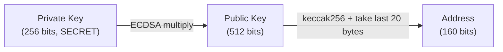
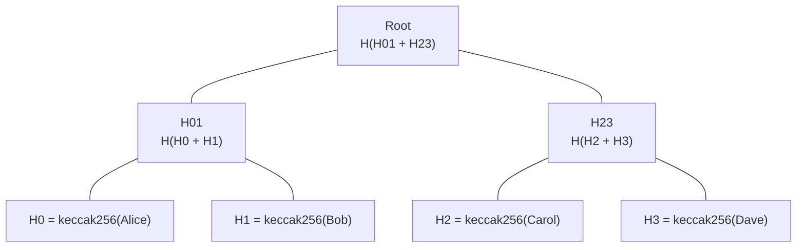

# Module 2 — Cryptographic Building Blocks

> **Part 1 · Blockchain & Cryptography Foundations**

---

## Learning Objectives

After completing this module you will be able to:

1. Explain what a cryptographic hash function is and why keccak256 is used in Ethereum
2. Sign and verify messages using ECDSA (Elliptic Curve Digital Signature Algorithm)
3. Build and verify a Merkle tree; understand its role in light clients and airdrops
4. Use ethers.js to hash data and verify signatures programmatically

---

## 1. Hashing — The Fingerprint of Data

### What Is a Hash Function?

A hash function takes any input (text, image, a whole book) and returns a **fixed-size output** that looks random.

**Properties we need:**

| Property | Meaning |
|----------|---------|
| Deterministic | Same input → same output, always |
| Fast to compute | Instant for any input size |
| Pre-image resistant | Given a hash, you can't find the input |
| Collision resistant | You can't find two inputs with the same hash |
| Avalanche effect | Flip one bit of input → ~50% of output bits change |

### keccak256 — Ethereum's Hash Function

Ethereum uses **keccak256** (a variant of SHA-3). Output: 256 bits (32 bytes), displayed as 64 hex characters.

```text
keccak256("hello")  = 0x1c8aff950685c2ed4bc3174f3472287b56d9517b9c948127319a09a7a36deac8
keccak256("hello!") = 0xce0676bf3a0406ba94c6d27e6d28c08e39ad09a46eec34b12a9c16e29c8e4d96
```

One character change → completely different hash. That's the avalanche effect.

### Hands-On: Hash with ethers.js

```javascript
// hash-demo.js
import { ethers } from "ethers";

const h1 = ethers.keccak256(ethers.toUtf8Bytes("hello"));
const h2 = ethers.keccak256(ethers.toUtf8Bytes("hello!"));

console.log("hash('hello'): ", h1);
console.log("hash('hello!'):", h2);
console.log("Same?", h1 === h2); // false

// Hashing is used for:
// - Address derivation (from public key)
// - Function selectors (first 4 bytes of keccak256(signature))
// - Storage slot calculation
// - Merkle tree construction
```

Run it:
```bash
node hash-demo.js
```

---

## 2. Digital Signatures — Proving Identity Without Revealing Keys

### The Key Trio



| Key | Visibility | Purpose |
|-----|-----------|---------|
| Private key | Secret — never share | Signs messages; controls the account |
| Public key | Derived from private key | Used to verify signatures |
| Address | Last 20 bytes of `keccak256(publicKey)` | What people send ETH to |

### ECDSA in Plain English

1. **Sign:** Alice uses her private key + a message → produces a signature `(v, r, s)`
2. **Verify:** Anyone with the signature + message + public key can check: "Yes, the owner of this private key signed this message"
3. **Recover:** Given just the signature + message, you can extract the signer's address — this is how `ecrecover` works in Solidity

### Hands-On: Sign and Verify

```javascript
// sign-demo.js
import { ethers } from "ethers";

// NEVER use this private key in production!
const wallet = new ethers.Wallet(
  "0xac0974bec39a17e36ba4a6b4d238ff944bacb478cbed5efcae784d7bf4f2ff80" // Foundry default anvil key #0
);

const message = "I own this address";
const signature = await wallet.signMessage(message);
console.log("Signature:", signature);

// Anyone can verify
const recoveredAddress = ethers.verifyMessage(message, signature);
console.log("Recovered address:", recoveredAddress);
console.log("Matches signer?", recoveredAddress === wallet.address);
```

### In Solidity — `ecrecover`

```solidity
// SPDX-License-Identifier: MIT
pragma solidity ^0.8.24;

contract SignatureVerifier {
    /// @notice Verify that `signer` signed `message`
    function verify(
        address signer,
        string memory message,
        uint8 v,
        bytes32 r,
        bytes32 s
    ) external pure returns (bool) {
        // Ethereum signed message prefix
        bytes32 messageHash = keccak256(
            abi.encodePacked("\x19Ethereum Signed Message:\n32", keccak256(bytes(message)))
        );

        address recovered = ecrecover(messageHash, v, r, s);
        return recovered == signer;
    }
}
```

> **Why the `\x19Ethereum Signed Message:\n` prefix?** It prevents a signed message from being replayed as a raw transaction.

---

## 3. Merkle Trees — Proving Inclusion Efficiently

### Why Merkle Trees?

A Merkle tree lets you prove "this item is in a set of 1 million items" by providing only ~20 hashes instead of all 1 million.



### Airdrop Whitelist Use Case

1. Project builds a Merkle tree of eligible addresses → publishes the root on-chain
2. Alice wants to claim: she provides her address + the **proof** (the sibling hashes needed to reconstruct the root)
3. Contract hashes her address with the proof → checks if result equals the stored root
4. If yes → she's eligible, mint tokens

### Hands-On: Merkle Proof in JavaScript

```javascript
// merkle-demo.js
import { ethers } from "ethers";

function hashLeaf(addr) {
  return ethers.keccak256(ethers.AbiCoder.defaultAbiCoder().encode(["address"], [addr]));
}

function hashPair(a, b) {
  // Sort to make tree deterministic
  const [x, y] = a < b ? [a, b] : [b, a];
  return ethers.keccak256(
    ethers.AbiCoder.defaultAbiCoder().encode(["bytes32", "bytes32"], [x, y])
  );
}

const alice = "0x70997970C51812dc3A010C7d01b50e0d17dc79C8";
const bob   = "0x3C44CdDdB6a900fa2b585dd299e03d12FA4293BC";
const carol = "0x90F79bf6EB2c4f870365E785982E1f101E93b906";
const dave  = "0x15d34AAf54267DB7D7c367839AAf71A00a2C6A65";

const h0 = hashLeaf(alice);
const h1 = hashLeaf(bob);
const h2 = hashLeaf(carol);
const h3 = hashLeaf(dave);

const h01 = hashPair(h0, h1);
const h23 = hashPair(h2, h3);
const root = hashPair(h01, h23);

console.log("Merkle Root:", root);

// Proof for Alice: [h1, h23]
function verifyProof(leaf, proof, root) {
  let computedHash = leaf;
  for (const p of proof) {
    computedHash = hashPair(computedHash, p);
  }
  return computedHash === root;
}

const aliceProof = [h1, h23];
console.log("Alice valid?", verifyProof(h0, aliceProof, root)); // true
console.log("Dave valid as Alice?", verifyProof(h3, aliceProof, root)); // false
```

### In Solidity — OpenZeppelin's `MerkleProof`

```solidity
// SPDX-License-Identifier: MIT
pragma solidity ^0.8.24;

import {MerkleProof} from "@openzeppelin/contracts/utils/cryptography/MerkleProof.sol";

contract AirdropClaim {
    bytes32 public merkleRoot;
    mapping(address => bool) public claimed;

    constructor(bytes32 _root) {
        merkleRoot = _root;
    }

    function claim(bytes32[] calldata proof) external {
        require(!claimed[msg.sender], "Already claimed");

        bytes32 leaf = keccak256(abi.encode(msg.sender));
        require(MerkleProof.verify(proof, merkleRoot, leaf), "Invalid proof");

        claimed[msg.sender] = true;
        // Mint tokens to msg.sender...
    }
}
```

---

## 4. Where These Primitives Appear in Ethereum

| Primitive | Where it's used |
|-----------|----------------|
| keccak256 | Address derivation, function selectors, storage slots, block hash |
| ECDSA | Transaction signing, meta-transactions, permit (EIP-2612) |
| Merkle trees | Light clients, airdrop whitelists, L2 fraud proofs |

---

## Checkpoint ✅

1. Hash the string `"blockchain"` using ethers.js — paste the output
2. Sign a message with a Foundry anvil wallet and recover the address
3. Build a 4-leaf Merkle tree on paper; write out the proof for the second leaf

---

## Common Pitfalls

| Pitfall | Clarification |
|---------|---------------|
| Using SHA-256 instead of keccak256 in Solidity | `sha256()` exists but Ethereum tooling expects `keccak256()` — they produce different outputs |
| Forgetting the Ethereum message prefix when signing | Raw signatures on un-prefixed messages can be replayed as transactions |
| Not sorting Merkle pairs | The tree must be deterministic; always sort sibling pairs before hashing |

---

## Further Reading

- [Ethereum Docs — Cryptography](https://ethereum.org/en/developers/docs/data-structures-and-encoding/)
- [OpenZeppelin MerkleProof](https://docs.openzeppelin.com/contracts/5.x/api/utils#MerkleProof)
- [Vitalik's Merkle Tree explainer](https://vitalik.eth.limo/general/2017/11/22/starks_part_1.html)
- [EIP-712 — Typed Structured Data Hashing and Signing](https://eips.ethereum.org/EIPS/eip-712)

---

**Previous →** [Module 1: Blockchain Fundamentals](./01-blockchain-fundamentals.md)  
**Next →** [Module 3: Wallets, Keys & Transactions](./03-wallets-keys-transactions.md)
