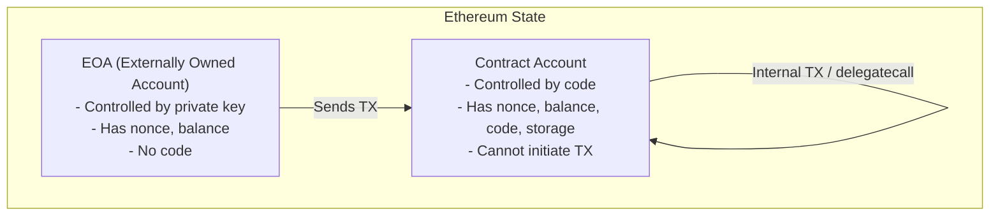
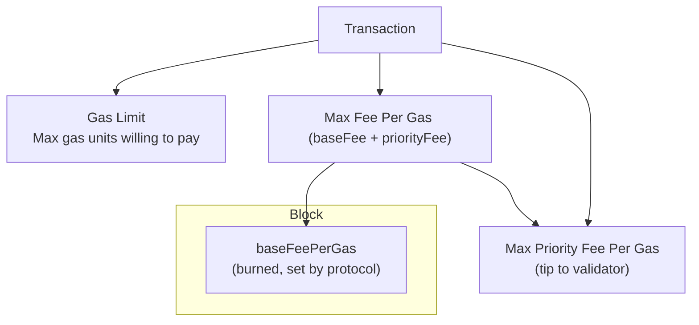
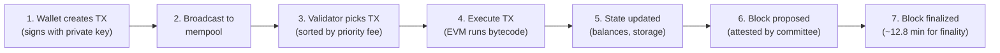

# Module 3 — Wallets, Keys & Transactions

> **Part 1 · Blockchain & Cryptography Foundations**

---

## Learning Objectives

After completing this module you will be able to:

1. Distinguish Externally Owned Accounts (EOAs) from Contract Accounts
2. Explain nonces and why transaction ordering matters
3. Break down a transaction's gas cost (base fee, priority fee, gas limit)
4. Trace how a transaction moves from wallet → mempool → block
5. Use `cast` (Foundry) to inspect transactions and balances on-chain

---

## 1. Account Types



| Feature | EOA | Contract |
|---------|-----|----------|
| Has private key | Yes | No |
| Can send transactions | Yes | Only when called |
| Has code | No | Yes |
| Has storage | No | Yes |
| Address derivation | `keccak256(pubkey)[-20:]` | `keccak256(rlp([sender, nonce]))[-20:]` |

**Key insight:** A contract can only act when triggered by a transaction. It cannot "wake up" and do things on its own.

---

## 2. Nonces — Transaction Ordering

Every EOA has a **nonce**: a counter that starts at 0 and increments by 1 for each transaction sent.

- **Purpose 1:** Prevents replay attacks (you can't submit the same TX twice)
- **Purpose 2:** Determines transaction ordering from the same sender
- **Purpose 3:** Determines the contract address when deploying

### Contract Address Derivation

```text
contractAddress = keccak256(rlp([senderAddress, nonce]))[12:]
```

This means you can predict a contract's address *before* it's deployed (used by CREATE2 for deterministic addresses).

### Hands-On: Check Nonce with `cast`

```bash
# Start local node
anvil &

# Check nonce of default anvil account
cast nonce 0xf39Fd6e51aad88F6F4ce6aB8827279cffFb92266
# Output: 0

# Send some ETH to increment nonce
cast send 0x70997970C51812dc3A010C7d01b50e0d17dc79C8 1ether \
  --private-key 0xac0974bec39a17e36ba4a6b4d238ff944bacb478cbed5efcae784d7bf4f2ff80

# Nonce is now 1
cast nonce 0xf39Fd6e51aad88F6F4ce6aB8827279cffFb92266
```

---

## 3. Gas — Paying for Computation

### Why Gas Exists

- Every node executes every transaction → computation must be bounded
- Gas prevents infinite loops and spam
- Users pay for what they consume

### EIP-1559 Fee Model (Post London Fork)



**Effective gas price** = `baseFeePerGas + min(maxPriorityFeePerGas, maxFeePerGas - baseFeePerGas)`

| Component | Who gets it | Purpose |
|-----------|-------------|---------|
| `baseFeePerGas` | **Burned** (destroyed) | Protocol-level demand pricing |
| `maxPriorityFeePerGas` | Validator | Tip to incentivize inclusion |
| Unused gas | Refunded to sender | You only pay for what you use |

### Typical Gas Costs

| Operation | Gas |
|-----------|-----|
| Simple ETH transfer | 21,000 |
| ERC-20 transfer | ~65,000 |
| Contract deployment | 1,000,000+ |
| SSTORE (new slot) | 20,000 |
| SSTORE (update) | 5,000 |
| SLOAD | 2,100 (cold) / 100 (warm) |

---

## 4. Transaction Lifecycle



### The Mempool

- A "waiting room" for pending transactions
- **Public mempool:** visible to everyone (including searchers/bots → front-running risk)
- **Private mempools:** Flashbots Protect — bypass public mempool to prevent MEV

---

## 5. Transaction Types

| Type | Value | Description |
|------|-------|-------------|
| Legacy | `0x00` | Pre-EIP-1559, uses `gasPrice` |
| Access List | `0x01` | EIP-2930, pre-declare storage accesses |
| EIP-1559 | `0x02` | Base fee + priority fee (most common) |
| Blob | `0x03` | EIP-4844, for L2 data posting |

### Hands-On: Inspect a Transaction with `cast`

```bash
# Get latest block
cast block latest --json | jq '.number'

# Get a specific transaction
cast tx 0x... --json | jq '{from: .from, to: .to, gasUsed: .gas, type: .type}'

# Estimate gas for a transfer
cast estimate 0x70997970C51812dc3A010C7d01b50e0d17dc79C8 1ether
# Output: 21000

# Get current base fee
cast base-fee
```

---

## 6. Wallet Types

| Wallet | Type | Use Case |
|--------|------|----------|
| MetaMask | Browser extension (EOA) | Daily dApp interaction |
| Ledger/Trezor | Hardware wallet | Secure key storage |
| Safe (Gnosis) | Smart contract wallet (multisig) | Treasury management |
| Foundry `cast` | CLI wallet | Scripting and automation |

### Smart Contract Wallets (ERC-4337 / Account Abstraction)

Modern wallets like Safe are **smart contracts** that add features:
- Multi-signature approval
- Social recovery
- Gas sponsorship (someone else pays gas)
- Session keys

---

## 7. Mini-Project: Build a Gas Tracker Script

Create a script that fetches the last 10 blocks and prints their base fee and gas used.

```bash
#!/usr/bin/env bash
# gas-tracker.sh — track gas prices across blocks

LATEST=$(cast block latest --json | jq -r '.number')
echo "Latest block: $LATEST"
echo "======================================"
printf "%-10s %-20s %-15s\n" "Block" "Base Fee (gwei)" "Gas Used"
echo "======================================"

for i in $(seq 0 9); do
  BLOCK=$((LATEST - i))
  INFO=$(cast block $BLOCK --json 2>/dev/null)
  BASE_FEE=$(echo $INFO | jq -r '.baseFeePerGas // "0"')
  GAS_USED=$(echo $INFO | jq -r '.gasUsed')
  # Convert wei to gwei (divide by 1e9)
  BASE_FEE_GWEI=$(echo "scale=4; $BASE_FEE / 1000000000" | bc 2>/dev/null || echo "$BASE_FEE")
  printf "%-10s %-20s %-15s\n" "$BLOCK" "$BASE_FEE_GWEI" "$GAS_USED"
done
```

Run it against anvil or a real RPC:
```bash
export ETH_RPC_URL=https://eth-mainnet.g.alchemy.com/v2/YOUR_KEY
bash gas-tracker.sh
```

---

## Checkpoint ✅

1. Explain why nonces must be sequential — what happens if you send nonce 5 before nonce 4?
2. Calculate the gas cost: a transaction uses 65,000 gas, baseFee is 30 gwei, priority fee is 2 gwei. What's the total cost in ETH?
3. Use `cast` to find the balance and nonce of any address on mainnet

---

## Common Pitfalls

| Pitfall | Clarification |
|---------|---------------|
| Setting gas limit too low | TX fails with "out of gas" — you still pay for the gas used! |
| Nonce gap | If you send TX with nonce 5 but current nonce is 3, TX is stuck in mempool |
| Confusing `gasPrice` with `maxFeePerGas` | `gasPrice` is legacy; EIP-1559 uses `maxFeePerGas` + `maxPriorityFeePerGas` |
| Sending ETH to a contract without a `receive()` function | ETH is sent but the contract can't accept it → TX reverts |

---

## Further Reading

- [Ethereum Docs — Transactions](https://ethereum.org/en/developers/docs/transactions/)
- [EIP-1559: Fee Market Change](https://eips.ethereum.org/EIPS/eip-1559)
- [EIP-4337: Account Abstraction](https://eips.ethereum.org/EIPS/eip-4337)
- [Flashbots — MEV Explained](https://docs.flashbots.net/)

---

**Previous →** [Module 2: Cryptographic Building Blocks](./02-cryptography.md)  
**Next →** [Module 4: Development Environment Setup](./04-dev-environment-setup.md)
