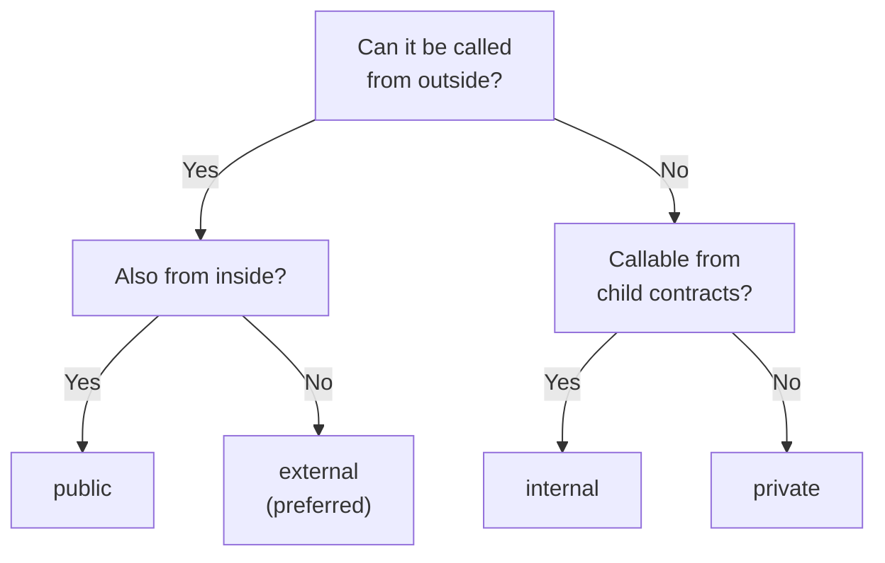
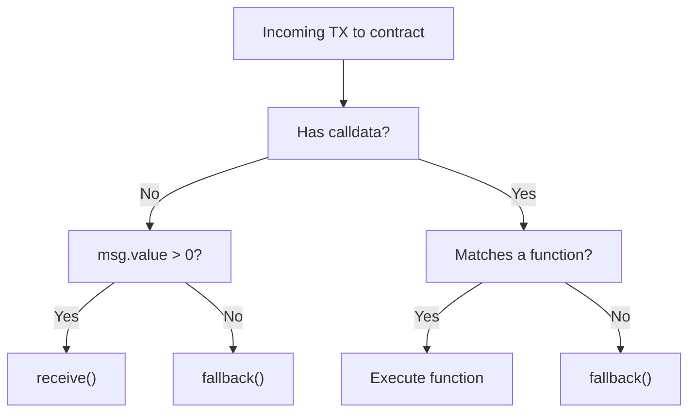
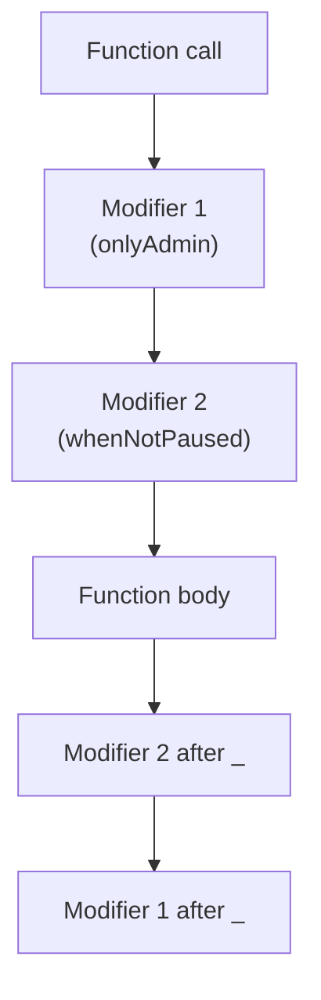

# Module 6 — Functions, Modifiers, Events & Errors

> **Part 2 · Solidity Programming**

---

## Learning Objectives

After completing this module you will be able to:

1. Use function visibility (`external`, `public`, `internal`, `private`) correctly
2. Write and apply custom modifiers for access control
3. Emit events for off-chain indexing
4. Handle errors with `require`, `revert`, custom errors, and `try/catch`
5. Use `view`, `pure`, `payable`, and `receive`/`fallback` functions

---

## 1. Function Visibility

```solidity
// SPDX-License-Identifier: MIT
pragma solidity ^0.8.24;

contract Visibility {
    uint256 private _count;

    // external — callable only from outside (cheapest gas for external calls)
    function externalFunc() external returns (uint256) {
        return _count;
    }

    // public — callable from outside AND inside (creates getter if state var)
    function publicFunc() public {
        _count++;
    }

    // internal — callable only from this contract and child contracts
    function _internalFunc() internal {
        _count += 10;
    }

    // private — callable only from this contract (not even children)
    function _privateFunc() private {
        _count = 0;
    }

    function callInternals() external {
        _internalFunc(); // OK
        _privateFunc();  // OK
    }
}
```

### Decision Guide



> **Best practice:** Default to `external` for functions that are only called externally. Use `public` only when the function needs internal access too.

---

## 2. Special Function Types

### `view` — Read State, Don't Modify

```solidity
function getBalance() external view returns (uint256) {
    return address(this).balance; // Reads blockchain state
}
```

### `pure` — No State Access At All

```solidity
function add(uint256 a, uint256 b) external pure returns (uint256) {
    return a + b; // Only uses inputs, no state reads
}
```

### `payable` — Accept ETH

```solidity
function deposit() external payable {
    // msg.value contains the ETH sent (in wei)
    require(msg.value > 0, "Must send ETH");
}
```

### `receive()` and `fallback()`

```solidity
contract PaymentReceiver {
    event Received(address sender, uint256 amount);
    event FallbackCalled(address sender, uint256 amount);

    // Called when ETH is sent with NO data
    receive() external payable {
        emit Received(msg.sender, msg.value);
    }

    // Called when data doesn't match any function, OR ETH sent with data
    fallback() external payable {
        emit FallbackCalled(msg.sender, msg.value);
    }
}
```



---

## 3. Modifiers — Reusable Pre/Post Conditions

Modifiers run code **before** and/or **after** the function body. Think of them as middleware.

```solidity
// SPDX-License-Identifier: MIT
pragma solidity ^0.8.24;

contract AccessControl {
    address public owner;
    mapping(address => bool) public admins;

    error NotOwner();
    error NotAdmin();
    error ContractPaused();

    bool public paused;

    constructor() {
        owner = msg.sender;
    }

    // Modifier: only owner
    modifier onlyOwner() {
        if (msg.sender != owner) revert NotOwner();
        _; // ← This is where the modified function body runs
    }

    // Modifier: only admin
    modifier onlyAdmin() {
        if (!admins[msg.sender] && msg.sender != owner) revert NotAdmin();
        _;
    }

    // Modifier: not paused
    modifier whenNotPaused() {
        if (paused) revert ContractPaused();
        _;
    }

    // Stacking modifiers: both must pass
    function adminAction() external onlyAdmin whenNotPaused {
        // Only admins can call this, and only when not paused
    }

    function togglePause() external onlyOwner {
        paused = !paused;
    }

    function addAdmin(address _admin) external onlyOwner {
        admins[_admin] = true;
    }
}
```

### Execution Order



---

## 4. Events — Logging for Off-Chain Systems

Events are **cheap** (log storage is cheaper than contract storage) and are the primary way for front-ends to react to on-chain changes.

```solidity
contract TokenTransfer {
    event Transfer(
        address indexed from,    // indexed = searchable/filterable (max 3)
        address indexed to,
        uint256 value            // non-indexed = readable in log data
    );

    event Approval(address indexed owner, address indexed spender, uint256 value);

    function transfer(address to, uint256 amount) external {
        // ... transfer logic ...
        emit Transfer(msg.sender, to, amount);
    }
}
```

### Reading Events (ethers.js)

```javascript
import { ethers } from "ethers";

const provider = new ethers.JsonRpcProvider("http://localhost:8545");
const contract = new ethers.Contract(address, abi, provider);

// Listen for Transfer events in real time
contract.on("Transfer", (from, to, value, event) => {
    console.log(`Transfer: ${from} → ${to}: ${ethers.formatEther(value)} tokens`);
});

// Query past events
const filter = contract.filters.Transfer(null, "0x1234...");
const events = await contract.queryFilter(filter, fromBlock, toBlock);
```

### `indexed` Keyword

- Up to **3** parameters can be `indexed`
- Indexed params become **topics** in the log (fast to filter)
- Non-indexed params are in the **data** section (cheaper, but can't filter by them)

---

## 5. Error Handling

### Three Error Mechanisms

| Mechanism | Gas Efficiency | When to Use |
|-----------|---------------|-------------|
| `require(condition, "message")` | Moderate (string in revert data) | Legacy / quick checks |
| Custom errors: `revert MyError()` | **Most efficient** | Production code |
| `assert(condition)` | N/A (should never fail) | Internal invariants |

### Custom Errors (Solidity ≥ 0.8.4)

```solidity
contract ErrorDemo {
    // Define custom errors (no gas cost to define)
    error InsufficientBalance(uint256 available, uint256 required);
    error Unauthorized(address caller);
    error DeadlineExpired(uint256 deadline, uint256 currentTime);

    mapping(address => uint256) public balances;

    function withdraw(uint256 amount) external {
        if (balances[msg.sender] < amount) {
            revert InsufficientBalance(balances[msg.sender], amount);
        }
        // ... withdrawal logic ...
    }

    function adminOnly() external view {
        if (msg.sender != address(0)) { // Example check
            revert Unauthorized(msg.sender);
        }
    }
}
```

### `try/catch` — Handle External Call Failures

```solidity
contract ErrorHandling {
    function safeCall(address target) external returns (bool) {
        try ITarget(target).doSomething() returns (uint256 result) {
            // Call succeeded
            return true;
        } catch Error(string memory reason) {
            // Revert with a reason string
            // Handle gracefully
            return false;
        } catch (bytes memory) {
            // Low-level failure (out of gas, invalid opcode, etc.)
            return false;
        }
    }
}

interface ITarget {
    function doSomething() external returns (uint256);
}
```

---

## 6. Mini-Project: Staking Contract

Build a contract where users can stake ETH and earn rewards.

```solidity
// SPDX-License-Identifier: MIT
pragma solidity ^0.8.24;

/// @title SimpleStaking — stake ETH, track rewards
/// @notice Demonstrates functions, modifiers, events, and errors
contract SimpleStaking {
    struct Stake {
        uint256 amount;
        uint256 timestamp;
    }

    mapping(address => Stake) public stakes;
    uint256 public totalStaked;
    uint256 public constant REWARD_RATE = 5; // 5% per year (simplified)
    address public owner;

    error AlreadyStaked();
    error NoActiveStake();
    error InsufficientStake();

    event Staked(address indexed user, uint256 amount);
    event Withdrawn(address indexed user, uint256 amount, uint256 reward);

    modifier hasNoStake() {
        if (stakes[msg.sender].amount > 0) revert AlreadyStaked();
        _;
    }

    modifier hasStake() {
        if (stakes[msg.sender].amount == 0) revert NoActiveStake();
        _;
    }

    constructor() {
        owner = msg.sender;
    }

    /// @notice Stake ETH
    function stake() external payable hasNoStake {
        if (msg.value == 0) revert InsufficientStake();
        stakes[msg.sender] = Stake({amount: msg.value, timestamp: block.timestamp});
        totalStaked += msg.value;
        emit Staked(msg.sender, msg.value);
    }

    /// @notice Withdraw stake + reward
    function withdraw() external hasStake {
        Stake memory userStake = stakes[msg.sender];
        uint256 duration = block.timestamp - userStake.timestamp;
        uint256 reward = (userStake.amount * REWARD_RATE * duration) / (365 days * 100);

        delete stakes[msg.sender]; // Reset stake
        totalStaked -= userStake.amount;

        (bool success,) = msg.sender.call{value: userStake.amount + reward}("");
        require(success, "Transfer failed");

        emit Withdrawn(msg.sender, userStake.amount, reward);
    }

    /// @notice View pending reward
    function pendingReward(address user) external view returns (uint256) {
        Stake memory userStake = stakes[user];
        if (userStake.amount == 0) return 0;
        uint256 duration = block.timestamp - userStake.timestamp;
        return (userStake.amount * REWARD_RATE * duration) / (365 days * 100);
    }
}
```

---

## Checkpoint ✅

1. Explain when to use `external` vs `public` — give a concrete example for each
2. Write a modifier that restricts a function to only be callable during business hours (9am-5pm)
3. Create a custom error that includes the caller's address and the function name
4. Deploy the `SimpleStaking` contract to anvil, stake 1 ETH, wait (warp time), and withdraw

---

## Common Pitfalls

| Pitfall | Clarification |
|---------|---------------|
| Using `require` with strings in production | Custom errors save gas and can include dynamic data |
| Forgetting `_` in a modifier | The modified function body won't execute |
| Making `receive()` complex | Keep it simple — it has a 2300 gas limit if called via `transfer()` |
| Emitting too many events | Events are cheap but not free; be intentional |

---

## Further Reading

- [Solidity Docs — Contracts](https://docs.soliditylang.org/en/latest/contracts.html)
- [EIP-712 — Typed Structured Data](https://eips.ethereum.org/EIPS/eip-712)
- [SWC Registry — Known Attack Patterns](https://swcregistry.io/)

---

**Previous →** [Module 5: Solidity Basics](./05-solidity-basics.md)  
**Next →** [Module 7: Inheritance, Interfaces & Abstract Contracts](./07-inheritance-interfaces-abstract.md)
