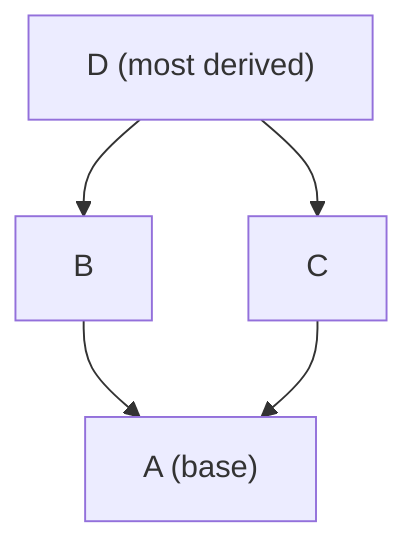
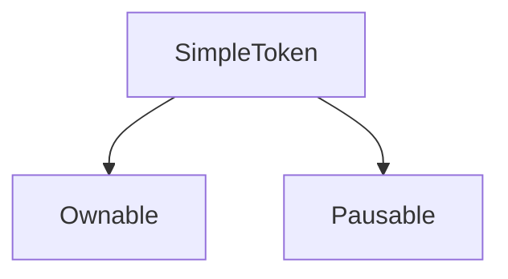

# Module 7 — Inheritance, Interfaces & Abstract Contracts

> **Part 2 · Solidity Programming**

---

## Learning Objectives

After completing this module you will be able to:

1. Use `is` to inherit from parent contracts
2. Understand the C3 linearisation order for multiple inheritance
3. Define and implement interfaces
4. Use abstract contracts with unimplemented functions
5. Build a simple token using inheritance

---

## 1. Inheritance — Reusing Contract Logic

### Basic Inheritance

```solidity
// SPDX-License-Identifier: MIT
pragma solidity ^0.8.24;

contract Ownable {
    address public owner;

    error NotOwner();

    modifier onlyOwner() {
        if (msg.sender != owner) revert NotOwner();
        _;
    }

    constructor() {
        owner = msg.sender;
    }

    function transferOwnership(address newOwner) external onlyOwner {
        owner = newOwner;
    }
}

// Vault inherits from Ownable
contract Vault is Ownable {
    mapping(address => uint256) public balances;

    function deposit() external payable {
        balances[msg.sender] += msg.value;
    }

    // Inherits onlyOwner modifier from Ownable
    function emergencyWithdraw() external onlyOwner {
        (bool success,) = owner.call{value: address(this).balance}("");
        require(success);
    }
}
```

### `super` — Calling Parent Functions

```solidity
contract Base {
    event Logged(string message);

    function doWork() public virtual {
        emit Logged("Base.doWork()");
    }
}

contract Child is Base {
    function doWork() public override {
        super.doWork(); // Calls Base.doWork()
        emit Logged("Child.doWork()");
    }
}
```

---

## 2. Multiple Inheritance & C3 Linearisation

Solidity supports **multiple inheritance**. The order matters — it determines which function "wins" in conflicts.

```solidity
contract A {
    function greet() public pure virtual returns (string memory) {
        return "Hello from A";
    }
}

contract B is A {
    function greet() public pure virtual override returns (string memory) {
        return "Hello from B";
    }
}

contract C is A {
    function greet() public pure virtual override returns (string memory) {
        return "Hello from C";
    }
}

// D inherits from B and C
// The order "B, C" means C is most derived (checked first)
contract D is B, C {
    function greet() public pure override(B, C) returns (string memory) {
        return "Hello from D";
    }

    function greetFromB() public pure returns (string memory) {
        return B.greet();
    }
}
```

### Linearisation Diagram



**Rule:** Always list parent contracts from "least derived" to "most derived" — the rightmost parent is the most specific.

---

## 3. Virtual and Override

- `virtual`: "This function can be overridden by child contracts"
- `override`: "I am overriding a parent's virtual function"
- `override(A, B)`: Required when overriding from multiple parents

```solidity
contract Base {
    function foo() public pure virtual returns (string memory) {
        return "base";
    }
}

contract Child is Base {
    function foo() public pure override returns (string memory) {
        return "child";
    }
}
```

---

## 4. Interfaces — Contracts Without Implementation

An interface defines **what** a contract does, not **how**.

```solidity
// SPDX-License-Identifier: MIT
pragma solidity ^0.8.24;

/// @title IERC20 — the ERC-20 token interface
interface IERC20 {
    function totalSupply() external view returns (uint256);
    function balanceOf(address account) external view returns (uint256);
    function transfer(address to, uint256 amount) external returns (bool);
    function allowance(address owner, address spender) external view returns (uint256);
    function approve(address spender, uint256 amount) external returns (bool);
    function transferFrom(address from, address to, uint256 amount) external returns (bool);

    event Transfer(address indexed from, address indexed to, uint256 value);
    event Approval(address indexed owner, address indexed spender, uint256 value);
}
```

### Rules for Interfaces
- Cannot have state variables (except constants)
- Cannot have constructors
- Cannot define function bodies
- All functions must be `external`
- Can inherit from other interfaces

### Using an Interface

```solidity
contract TokenTrader {
    function getTokenBalance(address token, address user) external view returns (uint256) {
        return IERC20(token).balanceOf(user);
    }

    function buyTokens(address token, uint256 amount) external payable {
        // Transfer ETH to the token contract, receive tokens back
        // (Simplified — real implementation needs more logic)
        IERC20(token).transfer(msg.sender, amount);
    }
}
```

---

## 5. Abstract Contracts

An abstract contract has **at least one function without a body** (marked with `virtual`). It cannot be deployed directly.

```solidity
abstract contract Shape {
    // Must be implemented by children
    function area() public pure virtual returns (uint256);

    // Can have implemented functions too
    function describe() public pure virtual returns (string memory) {
        return "A shape";
    }
}

contract Circle is Shape {
    uint256 public radius;

    constructor(uint256 _radius) {
        radius = _radius;
    }

    function area() public pure override returns (uint256) {
        return (314159 * 1 * 1) / 100000; // π * r² (simplified integer math)
    }

    function describe() public pure override returns (string memory) {
        return "A circle";
    }
}
```

### Interface vs Abstract

| Feature | Interface | Abstract Contract |
|---------|-----------|-------------------|
| Function bodies | No | Partial |
| State variables | Only constants | Yes |
| Constructors | No | Yes |
| Inheritance | Only from interfaces | From any contract |
| Deployable | No | No |
| Use case | Define external API | Share implementation logic |

---

## 6. Mini-Project: Simple Token Using Inheritance

Build a token by composing multiple contracts:

```solidity
// SPDX-License-Identifier: MIT
pragma solidity ^0.8.24;

/// @title Ownable — basic ownership pattern
contract Ownable {
    address public owner;

    error NotOwner();

    modifier onlyOwner() {
        if (msg.sender != owner) revert NotOwner();
        _;
    }

    constructor() {
        owner = msg.sender;
    }
}

/// @title Pausable — emergency pause functionality
abstract contract Pausable {
    bool public paused;

    error ContractPaused();
    error ContractNotPaused();

    event Paused(address account);
    event Unpaused(address account);

    modifier whenNotPaused() {
        if (paused) revert ContractPaused();
        _;
    }

    function _pause() internal {
        if (paused) revert ContractPaused();
        paused = true;
        emit Paused(msg.sender);
    }

    function _unpause() internal {
        if (!paused) revert ContractNotPaused();
        paused = false;
        emit Unpaused(msg.sender);
    }
}

/// @title SimpleToken — an ERC-20-like token with Ownable + Pausable
contract SimpleToken is Ownable, Pausable {
    string public name;
    string public symbol;
    uint8 public decimals = 18;
    uint256 public totalSupply;

    mapping(address => uint256) public balanceOf;
    mapping(address => mapping(address => uint256)) public allowance;

    event Transfer(address indexed from, address indexed to, uint256 value);
    event Approval(address indexed owner, address indexed spender, uint256 value);

    error InsufficientBalance();
    error InsufficientAllowance();

    constructor(string memory _name, string memory _symbol, uint256 _supply) {
        name = _name;
        symbol = _symbol;
        totalSupply = _supply * 10 ** decimals;
        balanceOf[msg.sender] = totalSupply;
        emit Transfer(address(0), msg.sender, totalSupply);
    }

    function transfer(address to, uint256 amount) external whenNotPaused returns (bool) {
        if (balanceOf[msg.sender] < amount) revert InsufficientBalance();
        balanceOf[msg.sender] -= amount;
        balanceOf[to] += amount;
        emit Transfer(msg.sender, to, amount);
        return true;
    }

    function approve(address spender, uint256 amount) external returns (bool) {
        allowance[msg.sender][spender] = amount;
        emit Approval(msg.sender, spender, amount);
        return true;
    }

    function transferFrom(address from, address to, uint256 amount) external whenNotPaused returns (bool) {
        if (allowance[from][msg.sender] < amount) revert InsufficientAllowance();
        if (balanceOf[from] < amount) revert InsufficientBalance();
        allowance[from][msg.sender] -= amount;
        balanceOf[from] -= amount;
        balanceOf[to] += amount;
        emit Transfer(from, to, amount);
        return true;
    }

    // Owner-only pause/unpause
    function pause() external onlyOwner {
        _pause();
    }

    function unpause() external onlyOwner {
        _unpause();
    }
}
```

### Inheritance Diagram



---

## Checkpoint ✅

1. Draw the inheritance chain for a contract that inherits from `Ownable`, `Pausable`, and `ERC20`
2. Explain what `super.foo()` does when `foo` is defined in two parent contracts
3. Write an interface `IVault` with `deposit()`, `withdraw()`, and `balance()` functions

---

## Common Pitfalls

| Pitfall | Clarification |
|---------|---------------|
| Diamond problem without `override(A, B)` | Solidity requires explicit resolution of conflicts from multiple inheritance |
| Inheriting in wrong order | "Least to most derived" — rightmost parent wins in C3 linearisation |
| State variable shadowing | A child can't redeclare a parent's state variable (use different names) |
| Using interfaces for shared logic | Interfaces can't have function bodies; use abstract contracts for shared implementation |

---

## Further Reading

- [Solidity Docs — Inheritance](https://docs.soliditylang.org/en/latest/contracts.html#inheritance)
- [C3 Linearisation](https://en.wikipedia.org/wiki/C3_linearization)
- [OpenZeppelin Contracts Architecture](https://docs.openzeppelin.com/contracts/5.x/)

---

**Previous →** [Module 6: Functions, Modifiers, Events & Errors](./06-functions-modifiers-events-errors.md)  
**Next →** [Module 8: Libraries & OpenZeppelin](./08-libraries-openzeppelin.md)
