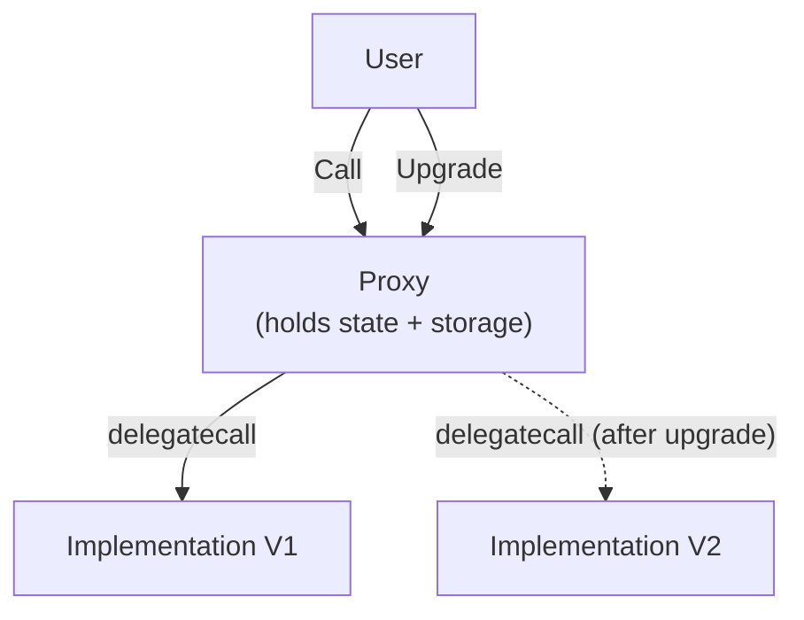
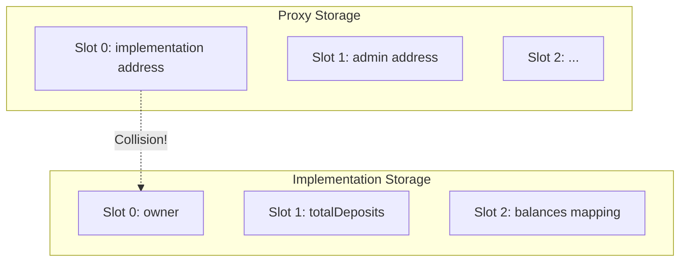

# Module 11 — Upgradeable Contracts

> **Part 3 · Testing, Tooling & Deployment**

---

## Learning Objectives

After completing this module you will be able to:

1. Explain why upgradeable contracts are needed (bugs, evolving logic)
2. Understand proxy patterns: Transparent Proxy and UUPS
3. Identify storage collision risks and use namespaced storage
4. Implement a UUPS-upgradeable contract with OpenZeppelin
5. Upgrade a contract on testnet using Foundry

---

## 1. Why Upgradeable Contracts?

Smart contracts are **immutable** once deployed. But real products need updates:

- Fix bugs discovered after deployment
- Add new features
- Update parameters or governance logic

**Solution:** Separate the contract into a **proxy** (immutable, holds state) and an **implementation** (upgradable logic).



---

## 2. Proxy Pattern — How It Works

### The Core Mechanism: `DELEGATECALL`

When a user calls the proxy:
1. Proxy's `fallback()` catches the call
2. `DELEGATECALL` forwards it to the implementation
3. **Implementation's code runs in the proxy's context** (proxy's storage, proxy's balance)

```solidity
// Simplified proxy logic
contract Proxy {
    address public implementation;

    fallback() external payable {
        address impl = implementation;
        assembly {
            calldatacopy(0, 0, calldatasize())
            let result := delegatecall(gas(), impl, 0, calldatasize(), 0, 0)
            returndatacopy(0, 0, returndatasize())
            switch result
            case 0 { revert(0, returndatasize()) }
            default { return(0, returndatasize()) }
        }
    }
}
```

---

## 3. Transparent Proxy vs UUPS

| Feature | Transparent Proxy | UUPS (Universal Upgradeable Proxy Standard) |
|---------|-------------------|---------------------------------------------|
| Upgrade logic | In the proxy | In the implementation |
| Admin vs User routing | Proxy routes differently based on caller | No routing distinction |
| Gas cost | Higher (admin checks on every call) | Lower |
| Complexity | More complex proxy | Simpler proxy, logic in impl |
| **Recommended** | Legacy | **Modern standard** |

---

## 4. UUPS Implementation

```solidity
// SPDX-License-Identifier: MIT
pragma solidity ^0.8.24;

import {UUPSUpgradeable} from "@openzeppelin/contracts-upgradeable/proxy/utils/UUPSUpgradeable.sol";
import {OwnableUpgradeable} from "@openzeppelin/contracts-upgradeable/access/OwnableUpgradeable.sol";
import {Initializable} from "@openzeppelin/contracts-upgradeable/proxy/utils/Initializable.sol";

/// @title VaultV1 — first version of an upgradeable vault
contract VaultV1 is Initializable, OwnableUpgradeable, UUPSUpgradeable {
    uint256 public totalDeposits;
    mapping(address => uint256) public balances;

    event Deposited(address indexed user, uint256 amount);
    event Withdrawn(address indexed user, uint256 amount);

    /// @custom:oz-upgrades-unsafe-allow constructor
    constructor() {
        _disableInitializers(); // Prevents implementation from being initialized
    }

    /// @notice Replaces constructor for upgradeable contracts
    function initialize(address _owner) external initializer {
        __Ownable_init(_owner);
        __UUPSUpgradeable_init();
    }

    function deposit() external payable {
        balances[msg.sender] += msg.value;
        totalDeposits += msg.value;
        emit Deposited(msg.sender, msg.value);
    }

    function withdraw(uint256 amount) external {
        require(balances[msg.sender] >= amount, "Insufficient balance");
        balances[msg.sender] -= amount;
        totalDeposits -= amount;
        (bool success,) = msg.sender.call{value: amount}("");
        require(success);
        emit Withdrawn(msg.sender, amount);
    }

    /// @notice Only owner can upgrade the implementation
    function _authorizeUpgrade(address) internal override onlyOwner {}
}
```

### Version 2 — Adding Fees

```solidity
// SPDX-License-Identifier: MIT
pragma solidity ^0.8.24;

import {VaultV1} from "./VaultV1.sol";

/// @title VaultV2 — adds a withdrawal fee
contract VaultV2 is VaultV1 {
    uint256 public feeBps; // Fee in basis points (100 = 1%)
    address public feeRecipient;

    function initializeV2(uint256 _feeBps, address _feeRecipient) external reinitializer(2) {
        feeBps = _feeBps;
        feeRecipient = _feeRecipient;
    }

    function withdraw(uint256 amount) external {
        require(balances[msg.sender] >= amount, "Insufficient balance");
        balances[msg.sender] -= amount;
        totalDeposits -= amount;

        uint256 fee = (amount * feeBps) / 10_000;
        uint256 netAmount = amount - fee;

        if (fee > 0 && feeRecipient != address(0)) {
            (bool feeSuccess,) = feeRecipient.call{value: fee}("");
            require(feeSuccess);
        }

        (bool success,) = msg.sender.call{value: netAmount}("");
        require(success);
        emit Withdrawn(msg.sender, netAmount);
    }
}
```

---

## 5. Storage Collision — The #1 Danger



### Rules to Avoid Storage Collision

1. **Never reorder** existing state variables in an upgrade
2. **Never delete** state variables (they shift slots)
3. **Only append** new variables at the end
4. Use **storage gaps** (`uint256[50] __gap`) to reserve future slots
5. Use **ERC-7201 namespaced storage** for complex cases

### Storage Gap Example

```solidity
contract VaultV1 {
    uint256 public totalDeposits;
    mapping(address => uint256) public balances;
    // Reserve 50 slots for future variables
    uint256[50] private __gap;
}

contract VaultV2 is VaultV1 {
    uint256 public feeBps;          // Uses first gap slot
    address public feeRecipient;    // Uses second gap slot
    // Gap shrinks
    uint256[48] private __gap;
}
```

---

## 6. Deploying and Upgrading

### Deploy Script

```solidity
// SPDX-License-Identifier: MIT
pragma solidity ^0.8.24;

import {Script, console} from "forge-std/Script.sol";
import {ERC1967Proxy} from "@openzeppelin/contracts/proxy/ERC1967/ERC1967Proxy.sol";
import {VaultV1} from "../src/VaultV1.sol";

contract DeployVault is Script {
    function run() external {
        uint256 deployerKey = vm.envUint("PRIVATE_KEY");
        address deployer = vm.addr(deployerKey);

        vm.startBroadcast(deployerKey);

        // 1. Deploy implementation
        VaultV1 impl = new VaultV1();
        console.log("Implementation V1:", address(impl));

        // 2. Deploy proxy pointing to implementation
        bytes memory initData = abi.encodeWithSelector(
            VaultV1.initialize.selector,
            deployer
        );
        ERC1967Proxy proxy = new ERC1967Proxy(address(impl), initData);
        console.log("Proxy:", address(proxy));

        vm.stopBroadcast();
    }
}
```

### Upgrade Script

```solidity
// SPDX-License-Identifier: MIT
pragma solidity ^0.8.24;

import {Script, console} from "forge-std/Script.sol";
import {VaultV2} from "../src/VaultV2.sol";
import {UUPSUpgradeable} from "@openzeppelin/contracts-upgradeable/proxy/utils/UUPSUpgradeable.sol";

contract UpgradeVault is Script {
    function run() external {
        uint256 deployerKey = vm.envUint("PRIVATE_KEY");
        address proxy = vm.envAddress("PROXY_ADDRESS");

        vm.startBroadcast(deployerKey);

        // 1. Deploy new implementation
        VaultV2 implV2 = new VaultV2();
        console.log("Implementation V2:", address(implV2));

        // 2. Upgrade proxy to V2
        UUPSUpgradeable(proxy).upgradeToAndCall(
            address(implV2),
            abi.encodeWithSelector(VaultV2.initializeV2.selector, 100, vm.addr(deployerKey)) // 1% fee
        );

        vm.stopBroadcast();
    }
}
```

---

## 7. Testing Upgradeable Contracts

```solidity
contract VaultUpgradeTest is Test {
    VaultV1 vault;

    function setUp() public {
        VaultV1 impl = new VaultV1();
        bytes memory data = abi.encodeWithSelector(VaultV1.initialize.selector, address(this));
        ERC1967Proxy proxy = new ERC1967Proxy(address(impl), data);
        vault = VaultV1(address(proxy));
    }

    function test_Upgrade() public {
        vault.deposit{value: 1 ether}();
        assertEq(vault.balances(address(this)), 1 ether);

        // Upgrade to V2
        VaultV2 implV2 = new VaultV2();
        vault.upgradeToAndCall(
            address(implV2),
            abi.encodeWithSelector(VaultV2.initializeV2.selector, 100, address(this))
        );

        // V2 features work
        VaultV2 v2 = VaultV2(address(vault));
        assertEq(v2.feeBps(), 100);

        // State preserved
        assertEq(v2.balances(address(this)), 1 ether);
    }
}
```

---

## Checkpoint ✅

1. Explain the difference between `delegatecall` and `call` in the context of proxies
2. Deploy a UUPS proxy on anvil, upgrade it, and verify state is preserved
3. What happens if you reorder state variables between V1 and V2?

---

## Common Pitfalls

| Pitfall | Clarification |
|---------|---------------|
| Reordering state variables | Slots shift — data corruption |
| Forgetting `initializer` modifier | Implementation contract can be hijacked |
| Not using `_disableInitializers()` in constructor | Implementation can be initialized and taken over |
| Upgrading to a contract with a different storage layout | Always use `forge coverage` or `oz-upgrades` to validate |

---

## Further Reading

- [OpenZeppelin Upgrades Docs](https://docs.openzeppelin.com/upgrades-plugins/1.x/)
- [EIP-1822: UUPS](https://eips.ethereum.org/EIPS/eip-1822)
- [EIP-1967: Proxy Storage Slots](https://eips.ethereum.org/EIPS/eip-1967)
- [EIP-7201: Namespaced Storage](https://eips.ethereum.org/EIPS/eip-7201)

---

**Previous →** [Module 10: Deploying & Verifying](./10-deploying-verifying.md)  
**Next →** [Module 12: Gas Optimisation](./12-gas-optimisation.md)
