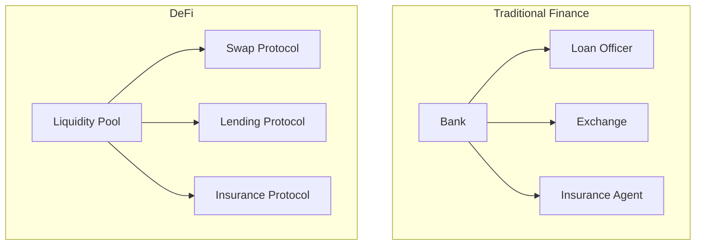
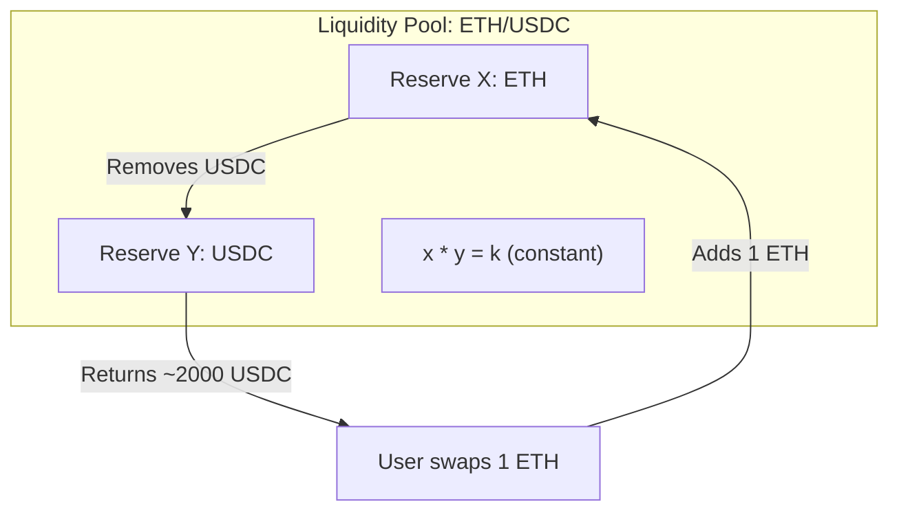

# Module 15 — DeFi Foundations

> **Part 4 · Token Standards & DeFi Primitives**

---

## Learning Objectives

After completing this module you will be able to:

1. Explain what DeFi is and how it replaces traditional financial intermediaries
2. Understand the constant product formula (`x * y = k`) used by AMMs
3. Describe how liquidity pools work and how LP tokens represent ownership
4. Calculate price impact and impermanent loss
5. Build a basic liquidity pool from scratch

---

## 1. What Is DeFi?

**DeFi (Decentralised Finance)** = financial services without banks or brokers, running on smart contracts.



| Service | Traditional | DeFi |
|---------|-------------|------|
| Currency exchange | FX broker (takes 1-3%) | DEX (Uniswap, 0.3%) |
| Lending | Bank (requires credit check) | Aave/Compound (collateralised) |
| Derivatives | CME/options exchange | dYdX, GMX |
| Insurance | Insurance company | Nexus Mutual |
| Savings | Bank (0.01% APY) | Staking, yield farming (3-15%) |

---

## 2. Automated Market Makers (AMMs)

### The Problem

Traditional exchanges use **order books** — buyers and sellers submit limit orders, and a matching engine pairs them. This requires high liquidity and fast infrastructure.

### The Solution: Constant Product Formula

An AMM uses a mathematical formula to set prices automatically:

\[ x \times y = k \]

Where:
- `x` = reserve of token A
- `y` = reserve of token B
- `k` = constant (invariant)



### Price Calculation

The **spot price** of token A in terms of token B:

\[ \text{price}_A = \frac{y}{x} \]

If reserves are 10 ETH and 20,000 USDC:
- Price of 1 ETH = 20,000 / 10 = 2,000 USDC
- Adding 1 ETH: reserves become 11 ETH and ~18,181 USDC (k = 200,000)
- User receives: 20,000 - 18,181 = ~1,818 USDC (less than spot price due to slippage)

### Slippage

The bigger the trade relative to the pool, the worse the price. This is **slippage**.

| Trade size | Pool reserves | Slippage |
|------------|---------------|----------|
| 0.1 ETH | 100 ETH | ~0.1% |
| 1 ETH | 100 ETH | ~1% |
| 10 ETH | 100 ETH | ~9% |
| 50 ETH | 100 ETH | ~33% |

---

## 3. Liquidity Pools

### How They Work

1. **Liquidity Providers (LPs)** deposit equal value of both tokens
2. They receive **LP tokens** representing their share of the pool
3. They earn a percentage of trading fees (proportional to their share)
4. They can withdraw at any time by burning LP tokens

### LP Token Math

```
lpTokensMinted = (depositAmount / totalReserve) * totalLpSupply
```

On first deposit (empty pool):
```
lpTokensMinted = sqrt(amountA * amountB)  // Geometric mean
```

### Impermanent Loss

When token prices diverge, LPs lose compared to just holding. This is **impermanent loss** (IL) — it becomes permanent only if you withdraw.

| Price Change | Impermanent Loss |
|--------------|-----------------|
| ±25% | ~0.6% |
| ±50% | ~2.0% |
| 2x | ~5.7% |
| 3x | ~13.4% |
| 5x | ~25.5% |

IL is offset by trading fees — if fees earned > IL, LPs profit.

---

## 4. Building a Basic Liquidity Pool

```solidity
// SPDX-License-Identifier: MIT
pragma solidity ^0.8.24;

import {IERC20} from "@openzeppelin/contracts/token/ERC20/IERC20.sol";
import {SafeERC20} from "@openzeppelin/contracts/token/ERC20/utils/SafeERC20.sol";
import {ERC20} from "@openzeppelin/contracts/token/ERC20/ERC20.sol";
import {Math} from "@openzeppelin/contracts/utils/math/Math.sol";

/// @title SimpleLP — a basic constant-product liquidity pool
contract SimpleLP is ERC20 {
    using SafeERC20 for IERC20;

    IERC20 public immutable tokenA;
    IERC20 public immutable tokenB;

    uint256 public reserveA;
    uint256 public reserveB;

    uint256 public constant FEE_BPS = 30; // 0.3% fee

    event LiquidityAdded(address indexed provider, uint256 amountA, uint256 amountB);
    event LiquidityRemoved(address indexed provider, uint256 amountA, uint256 amountB);
    event Swap(address indexed user, address tokenIn, uint256 amountIn, uint256 amountOut);

    constructor(address _tokenA, address _tokenB)
        ERC20("Simple LP", "SLP")
    {
        tokenA = IERC20(_tokenA);
        tokenB = IERC20(_tokenB);
    }

    /// @notice Add liquidity to the pool
    function addLiquidity(uint256 amountA, uint256 amountB) external returns (uint256 liquidity) {
        tokenA.safeTransferFrom(msg.sender, address(this), amountA);
        tokenB.safeTransferFrom(msg.sender, address(this), amountB);

        uint256 _totalSupply = totalSupply();

        if (_totalSupply == 0) {
            // First deposit: LP tokens = sqrt(amountA * amountB)
            liquidity = Math.sqrt(amountA * amountB);
        } else {
            // Proportional deposit
            liquidity = Math.min(
                (amountA * _totalSupply) / reserveA,
                (amountB * _totalSupply) / reserveB
            );
        }

        require(liquidity > 0, "Insufficient liquidity");
        _mint(msg.sender, liquidity);

        reserveA += amountA;
        reserveB += amountB;

        emit LiquidityAdded(msg.sender, amountA, amountB);
    }

    /// @notice Remove liquidity
    function removeLiquidity(uint256 liquidity) external returns (uint256 amountA, uint256 amountB) {
        require(balanceOf(msg.sender) >= liquidity, "Insufficient LP tokens");

        uint256 _totalSupply = totalSupply();
        amountA = (liquidity * reserveA) / _totalSupply;
        amountB = (liquidity * reserveB) / _totalSupply;

        _burn(msg.sender, liquidity);
        reserveA -= amountA;
        reserveB -= amountB;

        tokenA.safeTransfer(msg.sender, amountA);
        tokenB.safeTransfer(msg.sender, amountB);

        emit LiquidityRemoved(msg.sender, amountA, amountB);
    }

    /// @notice Swap tokenA for tokenB (or vice versa)
    function swap(address tokenIn, uint256 amountIn) external returns (uint256 amountOut) {
        require(tokenIn == address(tokenA) || tokenIn == address(tokenB), "Invalid token");

        bool isTokenA = tokenIn == address(tokenA);
        (uint256 resIn, uint256 resOut) = isTokenA
            ? (reserveA, reserveB)
            : (reserveB, reserveA);

        // Apply fee: amountIn * (10000 - feeBps) / 10000
        uint256 amountInWithFee = amountIn * (10_000 - FEE_BPS);
        amountOut = (amountInWithFee * resOut) / (resIn * 10_000 + amountInWithFee);

        IERC20(tokenIn).safeTransferFrom(msg.sender, address(this), amountIn);

        if (isTokenA) {
            reserveA += amountIn;
            reserveB -= amountOut;
            tokenB.safeTransfer(msg.sender, amountOut);
        } else {
            reserveB += amountIn;
            reserveA -= amountOut;
            tokenA.safeTransfer(msg.sender, amountOut);
        }

        emit Swap(msg.sender, tokenIn, amountIn, amountOut);
    }

    /// @notice Get expected output for a given input
    function getAmountOut(uint256 amountIn, uint256 resIn, uint256 resOut) external pure returns (uint256) {
        uint256 amountInWithFee = amountIn * (10_000 - 30);
        return (amountInWithFee * resOut) / (resIn * 10_000 + amountInWithFee);
    }
}
```

---

## 5. Key DeFi Concepts

### Yield Farming

Users move capital between protocols to maximise returns:
- Provide liquidity → earn trading fees
- Stake LP tokens → earn additional token rewards
- Deposit in lending protocol → earn interest

### Flash Loans

Borrow any amount without collateral — if you repay in the **same transaction**. Used for:
- Arbitrage
- Liquidations
- Collateral swaps

```solidity
// Flash loan pattern (simplified)
function flashLoan(uint256 amount) external {
    uint256 balanceBefore = token.balanceOf(address(this));

    token.transfer(msg.sender, amount); // Lend

    // ... user executes their strategy ...
    // Must call back with amount + fee

    require(token.balanceOf(address(this)) >= balanceBefore + fee, "Not repaid");
}
```

### Oracles

Protocols need external price data. Chainlink provides decentralised price feeds:

```solidity
import {AggregatorV3Interface} from "@chainlink/contracts/src/v0.8/interfaces/AggregatorV3Interface.sol";

contract PriceConsumer {
    AggregatorV3Interface internal priceFeed;

    constructor() {
        priceFeed = AggregatorV3Interface(0x5f4eC3Df9cbd43714FE2740f5E3616155c5b8419); // ETH/USD mainnet
    }

    function getLatestPrice() public view returns (int256) {
        (, int256 price,,,) = priceFeed.latestRoundData();
        return price; // e.g., 200000000000 = $2000.00 (8 decimals)
    }
}
```

---

## Checkpoint ✅

1. Calculate the output amount for swapping 1 ETH in a pool with 100 ETH and 200,000 USDC reserves (0.3% fee)
2. Deploy the SimpleLP contract and add liquidity with two test tokens
3. Explain impermanent loss with a numerical example
4. What is a flash loan and why can it be uncollateralised?

---

## Common Pitfalls

| Pitfall | Clarification |
|---------|---------------|
| Ignoring slippage in swap UI | Always show expected slippage and allow users to set tolerance |
| Not checking reserves are non-zero | Division by zero when pool is empty |
| LP token minting on first deposit | Use `sqrt(amountA * amountB)` to prevent manipulation |
| Oracle manipulation | Never use DEX spot prices as oracles; use Chainlink or TWAP |

---

## Further Reading

- [Uniswap V2 Whitepaper](https://uniswap.org/whitepaper.pdf)
- [Impermanent Loss Calculator](https://defi-lab.xyz/uniswapv2simulator)
- [Chainlink Data Feeds](https://docs.chain.link/data-feeds)
- [DeFi Llama](https://defillama.com/) — TVL tracker

---

**Previous →** [Module 14: ERC-721 & ERC-1155](./14-erc721-erc1155-nfts.md)  
**Next →** [Module 16: Building a Simple DEX](./16-building-simple-dex.md)
