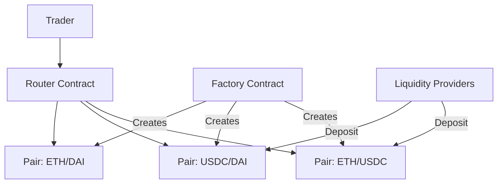

# Module 16 — Building a Simple DEX

> **Part 4 · Token Standards & DeFi Primitives**

---

## Learning Objectives

After completing this module you will be able to:

1. Design a DEX factory that creates pair pools
2. Implement swap routing across multiple pairs
3. Calculate and accrue protocol fees
4. Handle edge cases: re-entrancy, slippage protection, deadline enforcement
5. Write integration tests that simulate real trading scenarios

---

## 1. DEX Architecture



### Components

| Contract | Purpose |
|----------|---------|
| **Factory** | Creates and registers pair contracts |
| **Pair** | Holds two tokens, implements swap and liquidity logic |
| **Router** | Finds optimal path between tokens, handles ETH wrapping |

---

## 2. Factory Contract

```solidity
// SPDX-License-Identifier: MIT
pragma solidity ^0.8.24;

import {SimplePair} from "./SimplePair.sol";

/// @title SimpleDEXFactory — creates and tracks trading pairs
contract SimpleDEXFactory {
    mapping(address => mapping(address => address)) public getPair;
    address[] public allPairs;

    event PairCreated(address indexed tokenA, address indexed tokenB, address pair);

    error PairAlreadyExists();
    error IdenticalTokens();

    function createPair(address tokenA, address tokenB) external returns (address pair) {
        if (tokenA == tokenB) revert IdenticalTokens();
        (address t0, address t1) = tokenA < tokenB ? (tokenA, tokenB) : (tokenB, tokenA);
        if (getPair[t0][t1] != address(0)) revert PairAlreadyExists();

        pair = address(new SimplePair(t0, t1));

        getPair[t0][t1] = pair;
        getPair[t1][t0] = pair; // Reverse lookup
        allPairs.push(pair);

        emit PairCreated(t0, t1, pair);
    }

    function allPairsLength() external view returns (uint256) {
        return allPairs.length;
    }
}
```

---

## 3. Pair Contract

```solidity
// SPDX-License-Identifier: MIT
pragma solidity ^0.8.24;

import {IERC20} from "@openzeppelin/contracts/token/ERC20/IERC20.sol";
import {SafeERC20} from "@openzeppelin/contracts/token/ERC20/utils/SafeERC20.sol";
import {ERC20} from "@openzeppelin/contracts/token/ERC20/ERC20.sol";
import {Math} from "@openzeppelin/contracts/utils/math/Math.sol";
import {ReentrancyGuard} from "@openzeppelin/contracts/utils/ReentrancyGuard.sol";

/// @title SimplePair — constant-product AMM for two tokens
contract SimplePair is ERC20, ReentrancyGuard {
    using SafeERC20 for IERC20;

    address public immutable token0;
    address public immutable token1;

    uint112 private reserve0;
    uint112 private reserve1;
    uint32 private blockTimestampLast;

    uint256 public constant FEE_NUMERATOR = 997; // 0.3% fee
    uint256 public constant FEE_DENOMINATOR = 1000;

    uint256 public price0CumulativeLast;
    uint256 public price1CumulativeLast;

    event Mint(address indexed sender, uint256 amount0, uint256 amount1);
    event Burn(address indexed sender, uint256 amount0, uint256 amount1, address indexed to);
    event Swap(address indexed sender, uint256 amount0Out, uint256 amount1Out, address indexed to);
    event Sync(uint112 reserve0, uint112 reserve1);

    error InsufficientLiquidity();
    error InsufficientInput();
    error InsufficientOutput();
    error InvalidTo();
    error K();

    constructor(address _token0, address _token1) ERC20("Simple LP", "SLP") {
        token0 = _token0;
        token1 = _token1;
    }

    /// @notice Add liquidity (both tokens must be transferred first)
    function mint(address to) external nonReentrant returns (uint256 liquidity) {
        uint256 balance0 = IERC20(token0).balanceOf(address(this));
        uint256 balance1 = IERC20(token1).balanceOf(address(this));
        uint256 amount0 = balance0 - reserve0;
        uint256 amount1 = balance1 - reserve1;

        uint256 _totalSupply = totalSupply();

        if (_totalSupply == 0) {
            liquidity = Math.sqrt(amount0 * amount1);
            _mint(address(1), 1000); // Lock minimum liquidity (prevents first-depositor attack)
        } else {
            liquidity = Math.min(
                (amount0 * _totalSupply) / reserve0,
                (amount1 * _totalSupply) / reserve1
            );
        }

        if (liquidity == 0) revert InsufficientLiquidity();
        _mint(to, liquidity);

        _update(balance0, balance1);
        emit Mint(msg.sender, amount0, amount1);
    }

    /// @notice Remove liquidity
    function burn(address to) external nonReentrant returns (uint256 amount0, uint256 amount1) {
        uint256 liquidity = balanceOf(address(this));
        uint256 _totalSupply = totalSupply();

        amount0 = (liquidity * reserve0) / _totalSupply;
        amount1 = (liquidity * reserve1) / _totalSupply;

        if (amount0 == 0 || amount1 == 0) revert InsufficientLiquidity();

        _burn(address(this), liquidity);
        IERC20(token0).safeTransfer(to, amount0);
        IERC20(token1).safeTransfer(to, amount1);

        uint256 balance0 = IERC20(token0).balanceOf(address(this));
        uint256 balance1 = IERC20(token1).balanceOf(address(this));
        _update(balance0, balance1);

        emit Burn(msg.sender, amount0, amount1, to);
    }

    /// @notice Swap tokens
    function swap(uint256 amount0Out, uint256 amount1Out, address to) external nonReentrant {
        if (amount0Out == 0 && amount1Out == 0) revert InsufficientOutput();
        if (amount0Out > 0 && amount1Out > 0) revert InsufficientOutput(); // Only one direction
        if (to == token0 || to == token1) revert InvalidTo();

        if (amount0Out >= reserve0 || amount1Out >= reserve1) revert InsufficientLiquidity();

        if (amount0Out > 0) IERC20(token0).safeTransfer(to, amount0Out);
        if (amount1Out > 0) IERC20(token1).safeTransfer(to, amount1Out);

        uint256 balance0 = IERC20(token0).balanceOf(address(this));
        uint256 balance1 = IERC20(token1).balanceOf(address(this));

        // Verify k invariant (with fee)
        uint256 balance0Adjusted = balance0 * FEE_DENOMINATOR;
        uint256 balance1Adjusted = balance1 * FEE_DENOMINATOR;

        if (balance0Adjusted * balance1Adjusted < uint256(reserve0) * reserve1 * FEE_DENOMINATOR ** 2) {
            revert K();
        }

        _update(balance0, balance1);
        emit Swap(msg.sender, amount0Out, amount1Out, to);
    }

    function _update(uint256 balance0, uint256 balance1) private {
        reserve0 = uint112(balance0);
        reserve1 = uint112(balance1);
        blockTimestampLast = uint32(block.timestamp);
        emit Sync(reserve0, reserve1);
    }

    function getReserves() external view returns (uint112, uint112, uint32) {
        return (reserve0, reserve1, blockTimestampLast);
    }

    /// @notice Calculate output amount
    function getAmountOut(uint256 amountIn, uint256 reserveIn, uint256 reserveOut) public pure returns (uint256) {
        if (amountIn == 0) revert InsufficientInput();
        if (reserveIn == 0 || reserveOut == 0) revert InsufficientLiquidity();
        uint256 amountInWithFee = amountIn * FEE_NUMERATOR;
        return (amountInWithFee * reserveOut) / (reserveIn * FEE_DENOMINATOR + amountInWithFee);
    }
}
```

---

## 4. Router Contract

```solidity
// SPDX-License-Identifier: MIT
pragma solidity ^0.8.24;

import {SimpleDEXFactory} from "./SimpleDEXFactory.sol";
import {SimplePair} from "./SimplePair.sol";
import {IERC20} from "@openzeppelin/contracts/token/ERC20/IERC20.sol";
import {SafeERC20} from "@openzeppelin/contracts/token/ERC20/utils/SafeERC20.sol";

/// @title SimpleDEXRouter — user-facing interface for trading
contract SimpleDEXRouter {
    using SafeERC20 for IERC20;

    SimpleDEXFactory public immutable factory;

    error Expired();
    error ExcessiveSlippage();

    constructor(address _factory) {
        factory = SimpleDEXFactory(_factory);
    }

    modifier ensure(uint256 deadline) {
        if (block.timestamp > deadline) revert Expired();
        _;
    }

    /// @notice Add liquidity to a pair
    function addLiquidity(
        address tokenA,
        address tokenB,
        uint256 amountADesired,
        uint256 amountBDesired,
        uint256 amountAMin,
        uint256 amountBMin,
        address to,
        uint256 deadline
    ) external ensure(deadline) returns (uint256 amountA, uint256 amountB, uint256 liquidity) {
        address pair = factory.getPair(tokenA, tokenB);
        require(pair != address(0), "Pair does not exist");

        // Transfer tokens to pair
        IERC20(tokenA).safeTransferFrom(msg.sender, pair, amountADesired);
        IERC20(tokenB).safeTransferFrom(msg.sender, pair, amountBDesired);

        // Mint LP tokens
        liquidity = SimplePair(pair).mint(to);
        amountA = amountADesired;
        amountB = amountBDesired;
    }

    /// @notice Swap exact tokens for tokens
    function swapExactTokensForTokens(
        uint256 amountIn,
        uint256 amountOutMin,
        address[] calldata path,
        address to,
        uint256 deadline
    ) external ensure(deadline) returns (uint256[] memory amounts) {
        amounts = _getAmountsOut(amountIn, path);
        if (amounts[amounts.length - 1] < amountOutMin) revert ExcessiveSlippage();

        // Transfer input tokens to first pair
        address firstPair = factory.getPair(path[0], path[1]);
        IERC20(path[0]).safeTransferFrom(msg.sender, firstPair, amountIn);

        // Execute swaps along path
        _swap(amounts, path, to);
    }

    function _swap(uint256[] memory amounts, address[] calldata path, address to) internal {
        for (uint256 i; i < path.length - 1; i++) {
            (address input, address output) = (path[i], path[i + 1]);
            (address token0,) = input < output ? (input, output) : (output, input);

            uint256 amountOut = amounts[i + 1];
            address nextPair = (i < path.length - 2)
                ? factory.getPair(path[i + 1], path[i + 2])
                : to;

            (uint256 amount0Out, uint256 amount1Out) = input == token0
                ? (uint256(0), amountOut)
                : (amountOut, uint256(0));

            SimplePair(factory.getPair(input, output)).swap(
                amount0Out,
                amount1Out,
                nextPair
            );
        }
    }

    function _getAmountsOut(uint256 amountIn, address[] calldata path) internal view returns (uint256[] memory amounts) {
        amounts = new uint256[](path.length);
        amounts[0] = amountIn;

        for (uint256 i; i < path.length - 1; i++) {
            (uint112 reserve0, uint112 reserve1,) = SimplePair(
                factory.getPair(path[i], path[i + 1])
            ).getReserves();

            (uint256 reserveIn, uint256 reserveOut) = path[i] < path[i + 1]
                ? (uint256(reserve0), uint256(reserve1))
                : (uint256(reserve1), uint256(reserve0));

            amounts[i + 1] = SimplePair(factory.getPair(path[i], path[i + 1]))
                .getAmountOut(amounts[i], reserveIn, reserveOut);
        }
    }

    /// @notice Get expected output for a given input
    function getAmountsOut(uint256 amountIn, address[] calldata path) external view returns (uint256[] memory) {
        return _getAmountsOut(amountIn, path);
    }
}
```

---

## 5. Testing the DEX

```solidity
// SPDX-License-Identifier: MIT
pragma solidity ^0.8.24;

import {Test} from "forge-std/Test.sol";
import {SimpleDEXFactory} from "../src/SimpleDEXFactory.sol";
import {SimplePair} from "../src/SimplePair.sol";
import {SimpleDEXRouter} from "../src/SimpleDEXRouter.sol";
import {ERC20} from "@openzeppelin/contracts/token/ERC20/ERC20.sol";

contract MockToken is ERC20 {
    constructor(string memory name) ERC20(name, name) {
        _mint(msg.sender, 1_000_000 ether);
    }
}

contract DEXTest is Test {
    SimpleDEXFactory factory;
    SimpleDEXRouter router;
    MockToken tokenA;
    MockToken tokenB;
    address alice = makeAddr("alice");

    function setUp() public {
        factory = new SimpleDEXFactory();
        router = new SimpleDEXRouter(address(factory));

        tokenA = new MockToken("TokenA");
        tokenB = new MockToken("TokenB");

        // Create pair
        factory.createPair(address(tokenA), address(tokenB));

        // Fund alice
        tokenA.transfer(alice, 100_000 ether);
        tokenB.transfer(alice, 100_000 ether);
    }

    function test_AddLiquidity() public {
        address pair = factory.getPair(address(tokenA), address(tokenB));

        tokenA.approve(address(router), 10_000 ether);
        tokenB.approve(address(router), 10_000 ether);

        router.addLiquidity(
            address(tokenA), address(tokenB),
            10_000 ether, 10_000 ether,
            0, 0,
            address(this),
            block.timestamp + 1 hours
        );

        assertGt(SimplePair(pair).totalSupply(), 0);
    }

    function test_Swap() public {
        // Add initial liquidity
        address pair = factory.getPair(address(tokenA), address(tokenB));
        tokenA.approve(address(router), 10_000 ether);
        tokenB.approve(address(router), 10_000 ether);
        router.addLiquidity(
            address(tokenA), address(tokenB),
            10_000 ether, 20_000 ether,
            0, 0,
            address(this),
            block.timestamp + 1 hours
        );

        // Swap
        vm.startPrank(alice);
        tokenA.approve(address(router), 100 ether);

        address[] memory path = new address[](2);
        path[0] = address(tokenA);
        path[1] = address(tokenB);

        uint256 balBefore = tokenB.balanceOf(alice);
        router.swapExactTokensForTokens(
            100 ether,
            1, // min output (accept any)
            path,
            alice,
            block.timestamp + 1 hours
        );
        uint256 balAfter = tokenB.balanceOf(alice);

        assertGt(balAfter - balBefore, 190 ether); // ~197 USDC (with slippage + fee)
        vm.stopPrank();
    }
}
```

---

## Checkpoint ✅

1. Deploy the Factory, create a pair, and add liquidity
2. Execute a swap and verify the output matches the constant product formula
3. Add a deadline check and test that expired transactions revert
4. Implement multi-hop routing (Token A → Token B → Token C)

---

## Common Pitfalls

| Pitfall | Clarification |
|---------|---------------|
| Not locking the pair during swaps | Re-entrancy between mint/swap/burn can drain funds |
| Using spot price from DEX as oracle | Manipulable in one transaction; use TWAP (time-weighted average) |
| Ignoring the first-depositor attack | Lock minimum liquidity (send 1000 wei to dead address) |
| No slippage protection | Always enforce `amountOutMin` on swaps |

---

## Further Reading

- [Uniswap V2 Core Contracts](https://github.com/Uniswap/v2-core)
- [Uniswap V2 Whitepaper](https://uniswap.org/whitepaper.pdf)
- [Curve Finance — StableSwap](https://curve.fi/files/stableswap-paper.pdf)

---

**Previous →** [Module 15: DeFi Foundations](./15-defi-foundations.md)  
**Next →** [Module 17: Lending & Borrowing](./17-lending-borrowing.md)
