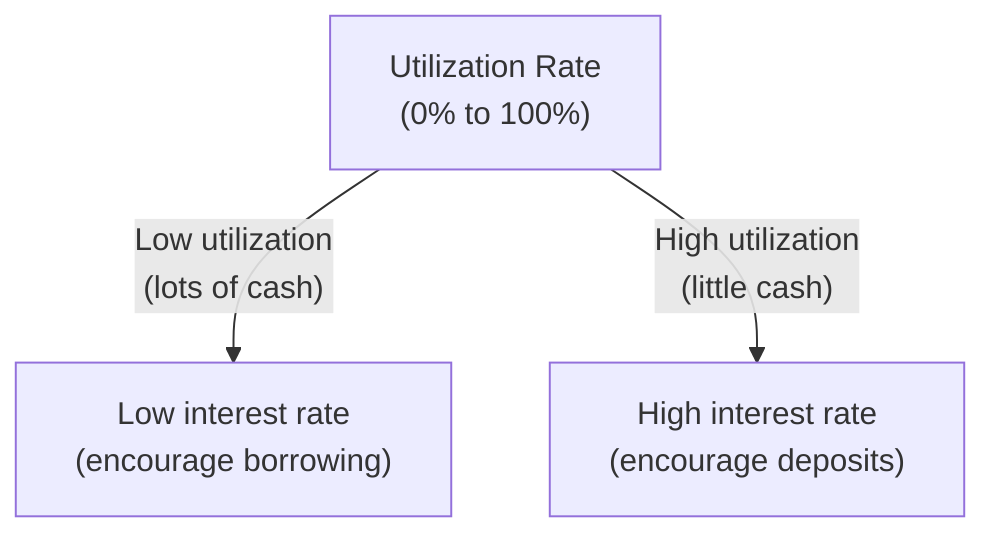

# Module 17 — Lending & Borrowing Basics

> **Part 4 · Token Standards & DeFi Primitives**

---

## Learning Objectives

After completing this module you will be able to:

1. Explain overcollateralised lending and why it's necessary in DeFi
2. Understand interest rate models (linear and jump rate)
3. Build a simplified lending protocol with deposits, borrows, and liquidations
4. Implement a health factor check and liquidation mechanism
5. Compare your implementation with Compound and Aave

---

## 1. Why Overcollateralised Lending?

In traditional finance, banks assess creditworthiness. In DeFi, there are **no credit scores** and **no identity**. The solution: require collateral worth more than the loan.

| Metric | Traditional | DeFi |
|--------|-------------|------|
| Collateral ratio | 80-95% (mortgages) | 150-200% (crypto loans) |
| Credit check | Required | Not needed |
| Liquidation | Legal process (months) | Automatic (seconds) |
| KYC | Required | Not required |

---

## 2. Interest Rate Model

### Linear Model (Compound-style)

\[ \text{utilizationRate} = \frac{\text{totalBorrows}}{\text{totalCash} + \text{totalBorrows}} \]

\[ \text{borrowRate} = \text{baseRate} + \text{utilizationRate} \times \text{multiplier} \]



### Jump Rate Model (Aave V2-style)

Below optimal utilization → low slope. Above optimal → steep slope to attract deposits.

```solidity
function getBorrowRate(uint256 cash, uint256 borrows) public pure returns (uint256) {
    uint256 utilizationRate = (borrows * 1e18) / (cash + borrows);
    uint256 optimalRate = 0.8e18; // 80% optimal

    uint256 baseRate = 0.02e18;    // 2% base rate
    uint256 slope1 = 0.04e18;      // 4% slope below optimal
    uint256 slope2 = 0.75e18;      // 75% slope above optimal

    if (utilizationRate <= optimalRate) {
        return baseRate + (utilizationRate * slope1) / optimalRate;
    } else {
        uint256 excessUtilization = utilizationRate - optimalRate;
        return baseRate + slope1 + (excessUtilization * slope2) / (1e18 - optimalRate);
    }
}
```

---

## 3. Simplified Lending Protocol

```solidity
// SPDX-License-Identifier: MIT
pragma solidity ^0.8.24;

import {IERC20} from "@openzeppelin/contracts/token/ERC20/IERC20.sol";
import {SafeERC20} from "@openzeppelin/contracts/token/ERC20/utils/SafeERC20.sol";
import {ReentrancyGuard} from "@openzeppelin/contracts/utils/ReentrancyGuard.sol";

/// @title SimpleLending — overcollateralised lending
contract SimpleLending is ReentrancyGuard {
    using SafeERC20 for IERC20;

    struct Market {
        uint256 totalDeposits;
        uint256 totalBorrows;
        uint256 lastUpdateTimestamp;
        uint256 borrowRatePerSecond;
        uint256 supplyRatePerSecond;
        uint256 borrowIndex; // Accumulator for compound interest
        bool isListed;
    }

    struct UserPosition {
        uint256 deposited;
        uint256 borrowed;
        uint256 borrowIndex; // User's snapshot of borrow index
    }

    IERC20 public collateralToken;  // e.g., WETH
    IERC20 public borrowToken;      // e.g., USDC

    Market public collateralMarket;
    Market public borrowMarket;

    mapping(address => UserPosition) public collateralPositions;
    mapping(address => UserPosition) public borrowPositions;

    uint256 public collateralFactor = 0.75e18; // 75% — can borrow up to 75% of collateral value
    uint256 public liquidationThreshold = 0.80e18; // 80%
    uint256 public liquidationBonus = 1.05e18; // 5% bonus for liquidators

    // Price oracle (simplified — in production, use Chainlink)
    uint256 public collateralPrice; // Price of collateral in borrow token terms (with 18 decimals)

    event Deposited(address indexed user, uint256 amount);
    event Borrowed(address indexed user, uint256 amount);
    event Repaid(address indexed user, uint256 amount);
    event Withdrawn(address indexed user, uint256 amount);
    event Liquidated(address indexed liquidator, address indexed borrower, uint256 seized);

    error InsufficientCollateral();
    error HealthFactorTooLow();
    error NotLiquidatable();
    error InsufficientRepayment();

    constructor(address _collateral, address _borrow) {
        collateralToken = IERC20(_collateral);
        borrowToken = IERC20(_borrow);

        collateralMarket.borrowIndex = 1e18;
        borrowMarket.borrowIndex = 1e18;
        collateralMarket.borrowRatePerSecond = 0.05e18 / 365 days; // 5% APY
        borrowMarket.borrowRatePerSecond = 0.08e18 / 365 days;     // 8% APY
    }

    /// @notice Set collateral price (oracle update — in production use Chainlink)
    function setCollateralPrice(uint256 _price) external {
        collateralPrice = _price;
    }

    /// @notice Deposit collateral
    function deposit(uint256 amount) external nonReentrant {
        _accrueInterest();
        collateralToken.safeTransferFrom(msg.sender, address(this), amount);
        collateralPositions[msg.sender].deposited += amount;
        collateralMarket.totalDeposits += amount;
        emit Deposited(msg.sender, amount);
    }

    /// @notice Borrow against collateral
    function borrow(uint256 amount) external nonReentrant {
        _accrueInterest();

        borrowPositions[msg.sender].borrowed += amount;
        borrowPositions[msg.sender].borrowIndex = borrowMarket.borrowIndex;
        borrowMarket.totalBorrows += amount;

        if (_getHealthFactor(msg.sender) < 1e18) revert HealthFactorTooLow();

        borrowToken.safeTransfer(msg.sender, amount);
        emit Borrowed(msg.sender, amount);
    }

    /// @notice Repay borrowed amount
    function repay(uint256 amount) external nonReentrant {
        _accrueInterest();
        UserPosition storage pos = borrowPositions[msg.sender];
        require(amount <= pos.borrowed, "Over-repayment");

        pos.borrowed -= amount;
        pos.borrowIndex = borrowMarket.borrowIndex;
        borrowMarket.totalBorrows -= amount;

        borrowToken.safeTransferFrom(msg.sender, address(this), amount);
        emit Repaid(msg.sender, amount);
    }

    /// @notice Withdraw collateral
    function withdraw(uint256 amount) external nonReentrant {
        _accrueInterest();
        UserPosition storage pos = collateralPositions[msg.sender];
        require(amount <= pos.deposited, "Exceeds deposit");

        pos.deposited -= amount;
        collateralMarket.totalDeposits -= amount;

        if (borrowPositions[msg.sender].borrowed > 0) {
            if (_getHealthFactor(msg.sender) < 1e18) revert HealthFactorTooLow();
        }

        collateralToken.safeTransfer(msg.sender, amount);
        emit Withdrawn(msg.sender, amount);
    }

    /// @notice Liquidate an unhealthy position
    function liquidate(address borrower, uint256 repayAmount) external nonReentrant {
        _accrueInterest();
        if (_getHealthFactor(borrower) >= 1e18) revert NotLiquidatable();

        UserPosition storage borrowPos = borrowPositions[borrower];
        UserPosition storage collPos = collateralPositions[borrower];

        // Calculate collateral to seize (with bonus)
        uint256 collateralSeized = (repayAmount * liquidationBonus) / collateralPrice;
        require(collateralSeized <= collPos.deposited, "Not enough collateral");

        // Update positions
        borrowPos.borrowed -= repayAmount;
        collPos.deposited -= collateralSeized;
        borrowMarket.totalBorrows -= repayAmount;
        collateralMarket.totalDeposits -= collateralSeized;

        // Transfer
        borrowToken.safeTransferFrom(msg.sender, address(this), repayAmount);
        collateralToken.safeTransfer(msg.sender, collateralSeized);

        emit Liquidated(msg.sender, borrower, collateralSeized);
    }

    // --- Internal ---

    function _accrueInterest() internal {
        uint256 elapsed = block.timestamp - borrowMarket.lastUpdateTimestamp;
        if (elapsed == 0) return;

        // Simple interest accrual
        uint256 interestAccrued = (borrowMarket.totalBorrows * borrowMarket.borrowRatePerSecond * elapsed) / 1e18;
        borrowMarket.totalBorrows += interestAccrued;
        borrowMarket.borrowIndex += (borrowMarket.borrowIndex * borrowMarket.borrowRatePerSecond * elapsed) / 1e18;
        borrowMarket.lastUpdateTimestamp = block.timestamp;
    }

    function _getHealthFactor(address user) internal view returns (uint256) {
        UserPosition storage borrowPos = borrowPositions[user];
        UserPosition storage collPos = collateralPositions[user];

        if (borrowPos.borrowed == 0) return type(uint256).max;

        uint256 collateralValue = (collPos.deposited * collateralPrice * collateralFactor) / 1e36;
        return (collateralValue * 1e18) / borrowPos.borrowed;
    }

    function getHealthFactor(address user) external view returns (uint256) {
        return _getHealthFactor(user);
    }
}
```

---

## 4. Compound vs Aave Comparison

| Feature | Compound V2 | Aave V3 |
|---------|-------------|---------|
| Interest model | Linear (utilization-based) | Variable + stable rates |
| Collateral | cTokens (yield-bearing) | aTokens (1:1 with deposit) |
| Flash loans | No | Yes (0.05% fee) |
| Liquidation | 50% max close factor | Up to 100% if HF < 0.95 |
| Governance | COMP token | AAVE token |
| Cross-chain | No | Yes (via LayerZero) |

---

## Checkpoint ✅

1. Deploy the lending protocol with two mock tokens and set a collateral price
2. Deposit collateral, borrow, and verify the health factor
3. Warp time forward to accrue interest, then check the new borrow amount
4. Trigger a liquidation by lowering the collateral price

---

## Common Pitfalls

| Pitfall | Clarification |
|---------|---------------|
| Not accruing interest before state changes | Always call `_accrueInterest()` first |
| Oracle manipulation | Use Chainlink or TWAP — never spot DEX price |
| Re-entrancy in withdraw/borrow | Use `ReentrancyGuard` and check-effects-interactions pattern |
| Underflow on liquidation math | Check all amounts before subtraction |

---

## Further Reading

- [Compound V2 Docs](https://docs.compound.finance/v2/)
- [Aave V3 Technical Paper](https://github.com/aave/aave-v3-core)
- [Euler Finance — Optimised Interest Rates](https://www.euler.finance/)

---

**Previous →** [Module 16: Building a Simple DEX](./16-building-simple-dex.md)  
**Next →** [Module 18: Layer-2 Scaling](./18-layer2-scaling.md)
