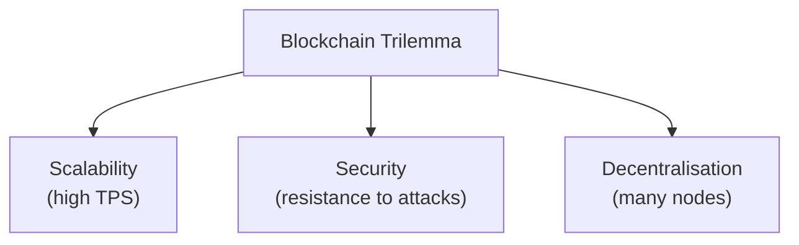
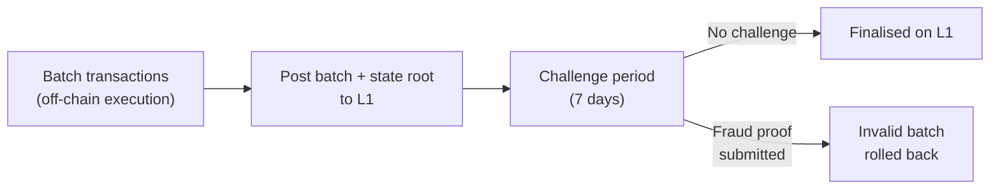
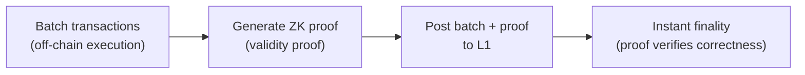

# Module 18 — Layer-2 Scaling

> **Part 5 · L2s, Sidechains & Advanced Patterns**

---

## Learning Objectives

After completing this module you will be able to:

1. Explain why L1 (Ethereum mainnet) needs scaling solutions
2. Compare Optimistic Rollups (Arbitrum, Optimism) with ZK Rollups (zkSync, Starknet)
3. Understand how bridges transfer assets between L1 and L2
4. Deploy and test contracts on Arbitrum and Optimism
5. Handle L2-specific concerns (sequencer downtime, message passing)

---

## 1. The Scalability Trilemma



Ethereum L1 prioritises **security** and **decentralisation** → ~15 TPS, expensive gas.

**Layer-2** solutions move execution off-chain but post proofs to L1 for security.

| Solution | How it works | TPS | Examples |
|----------|-------------|-----|----------|
| Optimistic Rollup | Assume valid, challenge within 7 days | ~4,000 | Arbitrum, Optimism, Base |
| ZK Rollup | Prove validity with math (ZK proofs) | ~10,000+ | zkSync Era, Starknet, Polygon zkEVM |
| Validium | ZK proofs, data off-chain | ~20,000+ | StarkEx, Immutable X |

---

## 2. Optimistic Rollups

### How They Work



1. **Sequencer** executes transactions off-chain and batches them
2. Batches are posted to L1 as calldata (compressed)
3. State root is posted to L1
4. **7-day challenge period** — anyone can submit a fraud proof
5. If fraud is proven → batch is reverted, sequencer loses bond

### Trade-offs

| Pro | Con |
|-----|-----|
| Cheap (~$0.01-0.10 per tx) | 7-day withdrawal to L1 |
| EVM-compatible (Solidity works) | Centralised sequencer (single point of failure) |
| Battle-tested (Arbitrum: $2B+ TVL) | Challenge period creates capital inefficiency |

---

## 3. ZK Rollups

### How They Work



1. Transactions executed off-chain
2. A **validity proof** (ZK-SNARK or ZK-STARK) is generated
3. Proof + batch posted to L1
4. L1 verifies the proof — if valid, state is final immediately

### Trade-offs

| Pro | Con |
|-----|-----|
| Instant withdrawals | Expensive proof generation |
| No challenge period | Not fully EVM-compatible (yet) |
| Higher theoretical TPS | Newer, less battle-tested |

---

## 4. Deploying to Arbitrum

```bash
# Configure foundry.toml
# [rpc_endpoints]
# arbitrum = "https://arb1.arbitrum.io/rpc"
# arbitrum_sepolia = "https://sepolia-rollup.arbitrum.io/rpc"

# Get testnet ETH (same faucet as Ethereum Sepolia, then bridge)
# Bridge: https://bridge.arbitrum.io

# Deploy to Arbitrum Sepolia
forge script script/DeployToken.s.sol:DeployToken \
  --rpc-url arbitrum_sepolia \
  --broadcast \
  --verify \
  --verifier etherscan \
  --verifier-url https://api-sepolia.arbiscan.io/api \
  --etherscan-api-key $ARBISCAN_API_KEY
```

### Arbitrum-Specific: `ArbSys` Precompile

```solidity
// Arbitrum precompile for L2 → L1 messaging
interface ArbSys {
    function sendTxToL1(address destAddr, bytes calldata calldataForL1)
        external payable returns (uint256);
    function isTopLevelCall() external view returns (bool);
}

contract ArbitrumBridge {
    ArbSys constant ARB_SYS = ArbSys(0x0000000000000000000000000000000000000064);

    function sendMessageToL1(bytes calldata data) external payable {
        ARB_SYS.sendTxToL1{value: msg.value}(msg.sender, data);
    }
}
```

---

## 5. Deploying to Optimism

```bash
# Optimism Sepolia
forge script script/DeployToken.s.sol:DeployToken \
  --rpc-url https://sepolia.optimism.io \
  --broadcast \
  --verify \
  --verifier etherscan \
  --verifier-url https://api-sepolia-optimistic.etherscan.io/api \
  --etherscan-api-key $OPSCAN_API_KEY
```

### Optimism-Specific: Cross-Domain Messenger

```solidity
interface ICrossDomainMessenger {
    function sendMessage(address _target, bytes calldata _message, uint32 _gasLimit) external;
}

contract OptimismBridge {
    ICrossDomainMessenger constant L2_MESSENGER =
        ICrossDomainMessenger(0x4200000000000000000000000000000000000007);

    function sendMessageToL1(address target, bytes calldata message) external {
        L2_MESSENGER.sendMessage(target, message, 200_000);
    }
}
```

---

## 6. L2-Specific Concerns

### Sequencer Downtime

If the sequencer is down, transactions can be submitted via the **delayed inbox** (Arbitrum) or **force inclusion** (Optimism). But there's a delay.

```solidity
// Handle potential stale data from sequencer
function getPrice() external view returns (uint256) {
    // Check if sequencer is active (Chainlink on L2)
    (, int256 answer, uint256 startedAt,,) = sequencerUptimeFeed.latestRoundData();
    require(answer == 0, "Sequencer is down");
    require(block.timestamp - startedAt > GRACE_PERIOD, "Grace period not over");

    return priceFeed.latestAnswer();
}
```

### L1 Data Costs

Rollups post transaction data to L1 as calldata. This is a major cost component.

- **EIP-4844 (Blob transactions):** Reduced L1 data costs by ~10-100x
- Post Dencun upgrade (March 2024), L2 fees dropped dramatically

---

## 7. L2 Comparison

| Feature | Arbitrum | Optimism | Base | zkSync Era |
|---------|----------|----------|------|------------|
| Type | Optimistic | Optimistic | Optimistic (OP Stack) | ZK |
| Withdrawal time | 7 days | 7 days | 7 days | ~1 hour |
| EVM compatibility | Full | Full | Full | ~99% |
| Sequencer | Centralised | Centralised | Centralised (Coinbase) | Centralised |
| Fraud proof | Interactive (live) | Fault proofs (Cannon) | Fault proofs (Cannon) | Validity proofs |
| Gas token | ETH | ETH | ETH | ETH |

---

## Checkpoint ✅

1. Deploy a contract to Arbitrum Sepolia and verify it on Arbiscan
2. Deploy the same contract to Optimism Sepolia
3. Compare gas costs between L1 (Sepolia) and L2 (Arbitrum Sepolia)
4. Explain why L2 withdrawals to L1 take 7 days on Optimistic rollups

---

## Common Pitfalls

| Pitfall | Clarification |
|---------|---------------|
| Assuming instant L2→L1 withdrawals | Optimistic rollups have 7-day challenge period |
| Using `block.timestamp` for randomness | Sequencer can manipulate timestamps on L2 |
| Not handling sequencer downtime | Always check sequencer status before using price oracles |
| Forgetting L2-specific precompiles | Arbitrum and Optimism have unique system contracts |

---

## Further Reading

- [Arbitrum Docs](https://docs.arbitrum.io/)
- [Optimism Docs](https://docs.optimism.io/)
- [EIP-4844: Blob Transactions](https://eips.ethereum.org/EIPS/eip-4844)
- [L2BEAT](https://l2beat.com/) — L2 analytics and risk assessment

---

**Previous →** [Module 17: Lending & Borrowing](./17-lending-borrowing.md)  
**Next →** [Module 19: Sidechains & Alt-EVMs](./19-sidechains-alt-evms.md)
