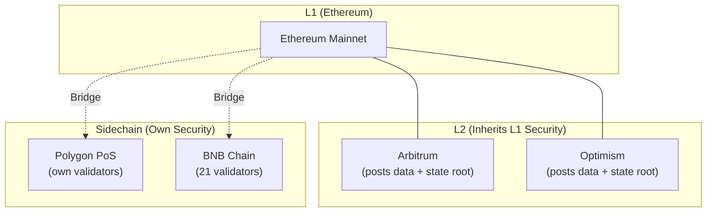

# Module 19 — Sidechains & Alt-EVMs

> **Part 5 · L2s, Sidechains & Advanced Patterns**

---

## Learning Objectives

After completing this module you will be able to:

1. Distinguish sidechains from L2 rollups (security model differences)
2. Deploy to Polygon PoS, BNB Chain, and Avalanche C-Chain
3. Understand multi-chain deployment strategies
4. Use bridging protocols for cross-chain asset transfers
5. Handle chain-specific quirks in your smart contracts

---

## 1. Sidechains vs L2 Rollups

| Feature | Sidechain | L2 Rollup |
|---------|-----------|-----------|
| Security | Own validator set | Inherits L1 security |
| Consensus | Independent | Posts to L1 |
| Trust assumption | Trust sidechain validators | Trust L1 |
| Finality | Independent | L1 finality (with delay) |
| Examples | Polygon PoS, BNB Chain | Arbitrum, Optimism |



---

## 2. Polygon PoS

### Key Facts
- **Type:** EVM-compatible sidechain
- **Consensus:** PoS (Bor + Heimdall)
- **Block time:** ~2 seconds
- **Gas token:** MATIC
- **Bridge:** Polygon PoS Bridge (trust-based)

### Deploying to Polygon

```bash
# Polygon Mumbai testnet (or Amoy)
forge script script/DeployToken.s.sol:DeployToken \
  --rpc-url https://rpc-amoy.polygon.technology \
  --broadcast \
  --verify \
  --verifier etherscan \
  --verifier-url https://api-amoy.polygonscan.com/api \
  --etherscan-api-key $POLYGONSCAN_API_KEY
```

### Polygon-Specific Considerations

```solidity
// Check if running on Polygon (chain ID = 137 mainnet, 80002 Amoy testnet)
function _isPolygon() internal view returns (bool) {
    return block.chainid == 137 || block.chainid == 80002;
}

// Polygon has faster blocks → adjust time-based logic
uint256 constant POLYGON_BLOCK_TIME = 2 seconds;
uint256 constant ETHEREUM_BLOCK_TIME = 12 seconds;
```

---

## 3. BNB Chain (formerly BSC)

### Key Facts
- **Type:** EVM-compatible sidechain (Go-Ethereum fork)
- **Consensus:** PoSA (Proof of Staked Authority, 21 validators)
- **Block time:** ~3 seconds
- **Gas token:** BNB
- **Bridge:** Multichain, Stargate

### Deploying to BNB Chain

```bash
# BNB Testnet
forge script script/DeployToken.s.sol:DeployToken \
  --rpc-url https://data-seed-prebsc-1-s1.binance.org:8545 \
  --broadcast \
  --verify \
  --verifier etherscan \
  --verifier-url https://api-testnet.bscscan.com/api \
  --etherscan-api-key $BSCSCAN_API_KEY
```

### BNB Chain Quirks

```solidity
// BNB Chain system contracts
address constant STAKING_CONTRACT = 0x0000000000000000000000000000000000001000;
address constant SLASH_CONTRACT = 0x0000000000000000000000000000000000001001;

// BNB (native token) is BEP-20 compatible
// No need for WBNB wrapper in most cases — native transfers work like ERC-20
```

---

## 4. Avalanche C-Chain

### Key Facts
- **Type:** EVM-compatible subnet (part of Avalanche network)
- **Consensus:** Snowman (Avalanche consensus)
- **Block time:** ~2 seconds
- **Gas token:** AVAX
- **Bridge:** Avalanche Bridge

### Deploying to Avalanche

```bash
# Avalanche Fuji testnet
forge script script/DeployToken.s.sol:DeployToken \
  --rpc-url https://api.avax-test.network/ext/bc/C/rpc \
  --broadcast \
  --verify \
  --verifier etherscan \
  --verifier-url https://api-testnet.snowtrace.io/api \
  --etherscan-api-key $SNOWTRACE_API_KEY
```

---

## 5. Multi-Chain Deployment Strategy

### Chain-Agnostic Contract Design

```solidity
// SPDX-License-Identifier: MIT
pragma solidity ^0.8.24;

import {Ownable} from "@openzeppelin/contracts/access/Ownable.sol";

/// @title MultiChainVault — works across EVM chains
contract MultiChainVault is Ownable {
    // Chain-specific configuration
    struct ChainConfig {
        address bridgeRouter;
        uint256 chainId;
        bool isSupported;
    }

    mapping(uint256 => ChainConfig) public chainConfigs;
    mapping(address => uint256) public deposits;

    event Deposited(address indexed user, uint256 amount, uint256 chainId);
    event CrossChainTransfer(address indexed from, uint256 toChainId, uint256 amount);

    error ChainNotSupported();

    constructor(address[] memory bridgeRouters, uint256[] memory chainIds) Ownable(msg.sender) {
        for (uint256 i; i < chainIds.length; i++) {
            chainConfigs[chainIds[i]] = ChainConfig({
                bridgeRouter: bridgeRouters[i],
                chainId: chainIds[i],
                isSupported: true
            });
        }
    }

    function deposit() external payable {
        deposits[msg.sender] += msg.value;
        emit Deposited(msg.sender, msg.value, block.chainid);
    }

    function crossChainTransfer(uint256 toChainId, uint256 amount) external {
        if (!chainConfigs[toChainId].isSupported) revert ChainNotSupported();
        require(deposits[msg.sender] >= amount, "Insufficient deposit");

        deposits[msg.sender] -= amount;
        // Bridge logic would go here (using LayerZero, Stargate, etc.)
        emit CrossChainTransfer(msg.sender, toChainId, amount);
    }
}
```

### Deployment Script for Multiple Chains

```solidity
// SPDX-License-Identifier: MIT
pragma solidity ^0.8.24;

import {Script, console} from "forge-std/Script.sol";
import {MultiChainVault} from "../src/MultiChainVault.sol";

contract DeployMultiChain is Script {
    function run() external {
        uint256 chainId = block.chainid;
        uint256 deployerKey = vm.envUint("PRIVATE_KEY");

        // Chain-specific bridge routers
        address[] memory bridgeRouters;
        uint256[] memory chainIds;

        if (chainId == 1) {
            // Ethereum mainnet
            bridgeRouters = new address[](2);
            chainIds = new uint256[](2);
            bridgeRouters[0] = address(0x1); // Arbitrum bridge
            chainIds[0] = 42161;
            bridgeRouters[1] = address(0x2); // Optimism bridge
            chainIds[1] = 10;
        } else if (chainId == 137) {
            // Polygon
            bridgeRouters = new address[](1);
            chainIds = new uint256[](1);
            bridgeRouters[0] = address(0x3); // Polygon bridge
            chainIds[0] = 137;
        }

        vm.startBroadcast(deployerKey);
        MultiChainVault vault = new MultiChainVault(bridgeRouters, chainIds);
        console.log("Vault deployed at:", address(vault));
        vm.stopBroadcast();
    }
}
```

### Deploy Script (bash)

```bash
#!/bin/bash
# deploy-all.sh — deploy to multiple chains

CHAINS=("sepolia" "arbitrum_sepolia" "optimism_sepolia" "polygon_amoy")

for chain in "${CHAINS[@]}"; do
    echo "Deploying to $chain..."
    forge script script/DeployMultiChain.s.sol:DeployMultiChain \
        --rpc-url $chain \
        --broadcast \
        --verify \
        -vv
    echo "---"
done
```

---

## 6. Cross-Chain Messaging

### LayerZero V2 (Simplified)

```solidity
import {OApp, Origin, MessagingFee} from "@layerzerolabs/oapp-evm/contracts/oapp/OApp.sol";

contract CrossChainMessage is OApp {
    mapping(uint32 => bytes32) public peers; // eid -> peer address

    function send(uint32 destEid, string calldata message) external payable {
        bytes memory payload = abi.encode(message);
        _lzSend(destEid, payload, options, MessagingFee(msg.value, 0), payable(msg.sender));
    }

    function _lzReceive(Origin calldata origin, bytes32, bytes calldata payload, address, bytes calldata)
        internal override
    {
        require(peers[origin.srcEid] == origin.sender, "Invalid sender");
        string memory message = abi.decode(payload, (string));
        // Process message
    }
}
```

---

## Checkpoint ✅

1. Deploy a contract to Polygon Amoy testnet
2. Deploy to BNB Chain testnet
3. Write a chain-aware contract that behaves differently on Ethereum vs Polygon
4. Research and compare bridging options: native bridges vs LayerZero vs Stargate

---

## Common Pitfalls

| Pitfall | Clarification |
|---------|---------------|
| Trusting sidechain security equally with L2s | Sidechains have their own validator set — less secure |
| Not adjusting block time assumptions | Polygon = 2s, Ethereum = 12s — time-based logic breaks |
| Using the wrong explorer API | Each chain has its own Etherscan (Polygonscan, Arbiscan, etc.) |
| Bridge vulnerabilities | Bridges are the #1 attack surface — use audited bridge protocols |

---

## Further Reading

- [Polygon Docs](https://docs.polygon.technology/)
- [BNB Chain Docs](https://docs.bnbchain.org/)
- [Avalanche Docs](https://docs.avax.network/)
- [LayerZero V2 Docs](https://docs.layerzero.network/)
- [ChainList](https://chainlist.org/) — RPC URLs and chain IDs

---

**Previous →** [Module 18: Layer-2 Scaling](./18-layer2-scaling.md)  
**Next →** [Module 20: Common Vulnerabilities](./20-common-vulnerabilities.md)
