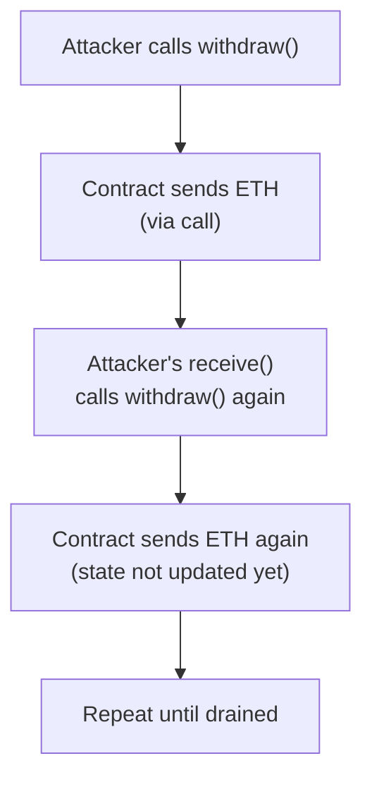
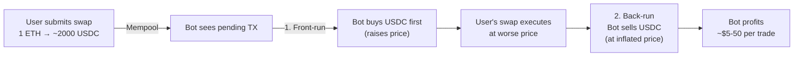

# Module 20 — Common Vulnerabilities

> **Part 6 · Security & Auditing**

---

## Learning Objectives

After completing this module you will be able to:

1. Identify and exploit re-entrancy attacks (and defend against them)
2. Understand front-running, sandwich attacks, and MEV
3. Recognise oracle manipulation vectors
4. Audit access control patterns for privilege escalation
5. Fix integer overflow/underflow and logic bugs

---

## 1. Re-Entrancy

### The Attack



### Vulnerable Code

```solidity
// VULNERABLE — DO NOT USE IN PRODUCTION
contract VulnerableVault {
    mapping(address => uint256) public balances;

    function deposit() external payable {
        balances[msg.sender] += msg.value;
    }

    function withdraw() external {
        uint256 amount = balances[msg.sender];
        // BUG: State updated AFTER external call
        (bool success,) = msg.sender.call{value: amount}("");
        require(success);
        balances[msg.sender] = 0; // Too late!
    }
}
```

### The Exploit

```solidity
contract Attacker {
    VulnerableVault public vault;

    constructor(address _vault) {
        vault = VulnerableVault(_vault);
    }

    function attack() external payable {
        vault.deposit{value: msg.value}();
        vault.withdraw();
    }

    receive() external payable {
        if (address(vault).balance > 0) {
            vault.withdraw(); // Re-enter before balance is set to 0
        }
    }
}
```

### The Fixes

```solidity
contract SafeVault {
    mapping(address => uint256) public balances;

    // Fix 1: Checks-Effects-Interactions pattern
    function withdraw() external {
        uint256 amount = balances[msg.sender];
        require(amount > 0);

        balances[msg.sender] = 0; // EFFECTS: Update state FIRST

        (bool success,) = msg.sender.call{value: amount}(""); // INTERACTIONS: External call LAST
        require(success);
    }

    // Fix 2: ReentrancyGuard
    // (add `import {ReentrancyGuard} from "@openzeppelin/contracts/utils/ReentrancyGuard.sol"`)
    // function withdraw() external nonReentrant { ... }

    // Fix 3: Pull over push (users claim instead of receiving)
    mapping(address => uint256) public pendingWithdrawals;
    function requestWithdraw() external {
        pendingWithdrawals[msg.sender] += balances[msg.sender];
        balances[msg.sender] = 0;
    }
    function claim() external {
        uint256 amount = pendingWithdrawals[msg.sender];
        pendingWithdrawals[msg.sender] = 0;
        (bool success,) = msg.sender.call{value: amount}("");
        require(success);
    }
}
```

---

## 2. Front-Running & MEV

### Sandwich Attack



### Protection Strategies

| Strategy | How |
|----------|-----|
| **Slippage tolerance** | User sets minimum acceptable output |
| **Deadline** | Transaction expires if not included by block N |
| **Private transactions** | Flashbots Protect — bypass public mempool |
| **Batch auctions** | CoW Protocol — all orders settle at same price |
| **Commit-reveal** | Submit hash first, reveal value later |

```solidity
function swap(
    uint256 amountIn,
    uint256 amountOutMin,  // Slippage protection
    uint256 deadline        // Expiry
) external {
    require(block.timestamp <= deadline, "Expired");

    uint256 amountOut = _calculateSwap(amountIn);
    require(amountOut >= amountOutMin, "Slippage too high");

    _executeSwap(amountIn, amountOut);
}
```

---

## 3. Oracle Manipulation

### DEX Price as Oracle (Vulnerable)

```solidity
// VULNERABLE — Uses spot DEX price
function getPrice() public view returns (uint256) {
    (uint112 reserve0, uint112 reserve1,) = IUniswapPair(pair).getReserves();
    return (uint256(reserve1) * 1e18) / reserve0;
}
```

An attacker can manipulate this in ONE transaction:
1. Flash loan a large amount
2. Swap to distort the price
3. Call your contract (which reads the manipulated price)
4. Repay the flash loan

### The Fix: Use Chainlink or TWAP

```solidity
// SAFE — Uses Chainlink oracle
function getPrice() public view returns (uint256) {
    (, int256 price,, uint256 updatedAt,) = priceFeed.latestRoundData();
    require(block.timestamp - updatedAt < 3600, "Stale price");
    require(price > 0, "Invalid price");
    return uint256(price);
}
```

---

## 4. Access Control Vulnerabilities

### Missing Access Checks

```solidity
// VULNERABLE — Anyone can mint
function mint(address to, uint256 amount) external {
    _mint(to, amount); // Missing onlyOwner or onlyRole!
}

// VULNERABLE — Initializer can be called by anyone
function initialize(address _owner) external {
    owner = _owner; // Missing initializer guard
}
```

### Unprotected `selfdestruct` / Delegatecall

```solidity
// VULNERABLE — Anyone can call
function destroy() external {
    selfdestruct(payable(msg.sender)); // No access control!
}

// VULNERABLE — Arbitrary delegatecall
function execute(address target, bytes calldata data) external {
    (bool success,) = target.delegatecall(data); // Attacker can call any function
    require(success);
}
```

---

## 5. Integer Overflow/Underflow

### Pre-0.8.0 (Dangerous)

```solidity
// Solidity 0.7.x — no overflow protection
uint8 x = 255;
x++; // Silently wraps to 0!

uint256 y = 0;
y--; // Silently wraps to 2^256 - 1!
```

### Post-0.8.0 (Safe by Default)

```solidity
// Solidity 0.8.x — automatic overflow checks
uint8 x = 255;
x++; // REVERTS with "arithmetic overflow"
```

### But `unchecked` Bypasses Safety

```solidity
unchecked {
    uint8 x = 255;
    x++; // Wraps to 0 — use only when intentional
}
```

---

## 6. Other Common Vulnerabilities

### Flash Loan Price Manipulation

```solidity
// VULNERABLE — Uses current pool reserves
function borrow(uint256 amount) external {
    uint256 collateralValue = _getTokenPrice() * balances[msg.sender];
    require(amount <= collateralValue * 75 / 100, "Undercollateralised");
    // ... borrow logic
}
```

### DoS via Revert (Push Pattern)

```solidity
// VULNERABLE — If one recipient reverts, everyone is blocked
function distribute() external {
    for (uint i = 0; i < recipients.length; i++) {
        (bool success,) = recipients[i].call{value: amounts[i]}("");
        require(success); // One revert = entire loop fails
    }
}

// SAFE — Pull pattern
mapping(address => uint256) public pending;
function distribute() external {
    for (uint i = 0; i < recipients.length; i++) {
        pending[recipients[i]] += amounts[i];
    }
}
function claim() external {
    uint256 amount = pending[msg.sender];
    pending[msg.sender] = 0;
    (bool success,) = msg.sender.call{value: amount}("");
    require(success);
}
```

### Signature Replay

```solidity
// VULNERABLE — Same signature works on multiple chains or multiple times
function execute(bytes calldata signature, address to, uint256 amount) external {
    // Missing: nonce, chainId, contract address in signed data
}
```

---

## 7. Mini-Project: Vulnerable Contract Audit Exercise

Given this contract, find and fix ALL vulnerabilities:

```solidity
// SPDX-License-Identifier: MIT
pragma solidity ^0.8.24;

contract VulnerableDEX {
    mapping(address => uint256) public balances;
    address public owner;

    constructor() { owner = msg.sender; }

    function deposit() external payable {
        balances[msg.sender] += msg.value;
    }

    // Find the bugs:
    function withdraw(uint256 amount) external {
        (bool s,) = msg.sender.call{value: balances[msg.sender]}("");
        require(s);
        balances[msg.sender] -= amount;
    }

    function setOwner(address newOwner) external {
        owner = newOwner; // Missing: onlyOwner
    }

    function getPrice() public view returns (uint256) {
        // Uses a DEX spot price (manipulable)
        return 2000 * 1e18;
    }
}
```

---

## Checkpoint ✅

1. Write a re-entrancy exploit for a vulnerable contract and then fix it
2. Explain the difference between front-running and sandwich attacks
3. Fix a contract that uses DEX spot price as an oracle
4. Identify three access control issues in a given contract

---

## Common Pitfalls

| Pitfall | Clarification |
|---------|---------------|
| Thinking Solidity 0.8+ eliminates all overflows | `unchecked` blocks bypass protection |
| "My contract uses `transfer()` so it's safe" | `transfer()` has 2300 gas limit — can break |
| Ignoring cross-function re-entrancy | Attacker calls function B from function A's external call |
| Assuming audits catch everything | Audits reduce risk but can't guarantee zero bugs |

---

## Further Reading

- [SWC Registry](https://swcregistry.io/) — Known vulnerability patterns
- [Rekt News](https://rekt.news/) — DeFi hack post-mortems
- [Ethernaut](https://ethernaut.openzeppelin.com/) — Hacking challenges
- [Damn Vulnerable DeFi](https://www.damnvulnerabledefi.xyz/) — DeFi-specific challenges

---

**Previous →** [Module 19: Sidechains & Alt-EVMs](./19-sidechains-alt-evms.md)  
**Next →** [Module 21: Formal Verification & Static Analysis](./21-formal-verification-static-analysis.md)
