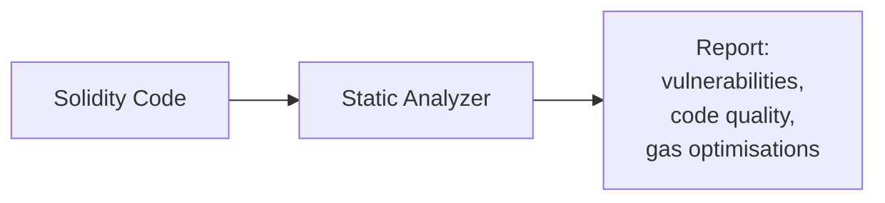

# Module 21 — Formal Verification & Static Analysis

> **Part 6 · Security & Auditing**

---

## Learning Objectives

After completing this module you will be able to:

1. Run Slither to detect common vulnerability patterns automatically
2. Use Aderyn for Solidity security analysis with custom detectors
3. Understand the basics of Certora Prover for formal verification
4. Integrate static analysis into CI/CD pipelines
5. Interpret findings and distinguish false positives from real issues

---

## 1. Static Analysis Overview

Static analysis examines code **without running it** — fast, automated, and catches common patterns.



| Tool | Type | Strengths |
|------|------|-----------|
| **Slither** | Static analysis | 80+ detectors, fast, Python-based |
| **Aderyn** | Static analysis | Cyfrin's tool, custom detectors, markdown reports |
| **Certora** | Formal verification | Mathematical proofs of correctness |
| **Echidna** | Fuzz testing | Property-based testing (covered in Module 9) |
| **Mythril** | Symbolic execution | Deep path exploration |

---

## 2. Slither — Static Analysis

### Installation

```bash
pip3 install slither-analyzer
# Or with Foundry (if solc-select needed)
pip3 install solc-select && solc-select install 0.8.24 && solc-select use 0.8.24
```

### Running Slither

```bash
# Full analysis
slither .

# Specific detector
slither . --detect reentrancy-eth

# Exclude informational findings
slither . --exclude-informational

# JSON output (for CI)
slither . --json report.json

# Print human summary
slither . --exclude-dependencies --filter-paths "lib/"
```

### Common Slither Detectors

| Detector | Severity | What it finds |
|----------|----------|---------------|
| `reentrancy-eth` | High | ETH re-entrancy patterns |
| `unchecked-lowlevel` | Medium | Unchecked low-level calls |
| `arbitrary-send-eth` | High | Functions that send ETH to arbitrary addresses |
| `controlled-delegatecall` | High | Delegatecall with user-controlled target |
| `uninitialized-state` | Medium | State variables never set |
| `shadowing-state` | Medium | Variable shadowing |
| `solc-version` | Info | Outdated compiler version |

### Example Findings

```
Slither report:
High: Reentrancy in Vault.withdraw()
  Contract: src/Vault.sol
  Function: withdraw()
  Line: 45

  External call: msg.sender.call{value: amount}("")
  State written after: balances[msg.sender] = 0

  Recommendation: Use Checks-Effects-Interactions pattern
```

---

## 3. Aderyn — Security Analysis

### Installation

```bash
# Install Aderyn (Cyfrin's tool)
curl -L https://raw.githubusercontent.com/Cyfrin/aderyn/dev/cyfrinup/install | bash
cyfrinup
```

### Running Aderyn

```bash
# Generate security report
aderyn .

# Output: report.md with categorised findings
# - Critical
# - High
# - Medium
# - Low
# - Informational
```

### Aderyn vs Slither

| Feature | Slither | Aderyn |
|---------|---------|--------|
| Language | Python | Rust |
| Output | Console/JSON | Markdown report |
| Custom detectors | Python plugins | Rust plugins |
| Speed | Fast | Very fast |
| CI integration | Easy | Easy |

---

## 4. Certora Prover — Formal Verification

Formal verification uses **mathematical proofs** to verify that properties always hold — not just for tested inputs, but for ALL possible inputs.

### Installation

```bash
pip3 install certora-cli
export CERTORAKEY="your_api_key" # Get from certora.com
```

### Writing a Spec

```solidity
// MyContract.sol
contract Vault {
    mapping(address => uint256) public balances;
    uint256 public totalDeposits;

    function deposit() external payable {
        balances[msg.sender] += msg.value;
        totalDeposits += msg.value;
    }

    function withdraw(uint256 amount) external {
        require(balances[msg.sender] >= amount);
        balances[msg.sender] -= amount;
        totalDeposits -= amount;
        (bool success,) = msg.sender.call{value: amount}("");
        require(success);
    }
}
```

```
// Vault.spec — Certora Verification Language (CVL)

methods {
    function totalDeposits() external returns (uint256) envfree;
    function balances(address) external returns (uint256) envfree;
}

// Invariant: totalDeposits == sum of all balances
invariant totalDepositsMatchesBalances(uint256 total) {
    total == totalDeposits() =>
        forall address a. balances(a) <= total
}

// Rule: withdraw cannot exceed balance
rule withdrawCannotExceedBalance(address user, uint256 amount) {
    require balances(user) >= amount;
    // After withdraw, balance should decrease by exactly amount
    mathint balBefore = balances(user);
    withdraw@withrevert(amount);
    mathint balAfter = balances(user);
    assert !lastReverted => balAfter == balBefore - amount;
}
```

### Running Certora

```bash
certoraRun src/Vault.sol --verify Vault:specs/Vault.spec --solc solc0.8.24
```

### What Formal Verification Catches That Fuzz Testing Misses

| Scenario | Fuzz Testing | Formal Verification |
|----------|-------------|-------------------|
| Specific edge case (e.g., max uint256) | Might miss | Covers all values |
| Invariant violations | Only if triggered | Proven or disproven |
| Complex state transitions | Limited depth | Explores all paths |
| Performance | Fast | Can take minutes/hours |

---

## 5. CI/CD Integration

### GitHub Actions — Slither

```yaml
# .github/workflows/slither.yml
name: Slither Analysis

on:
  push:
    branches: [main]
  pull_request:

jobs:
  slither:
    runs-on: ubuntu-latest
    steps:
      - uses: actions/checkout@v4
        with:
          submodules: recursive

      - name: Install Foundry
        uses: foundry-rs/foundry-toolchain@v1

      - name: Build
        run: forge build

      - name: Run Slither
        uses: crytic/slither-action@v0.4.0
        with:
          slither-args: "--exclude-informational --filter-paths lib/"
          sarif: results.sarif
        continue-on-error: true

      - name: Upload SARIF
        uses: github/codeql-action/upload-sarif@v3
        with:
          sarif_file: results.sarif
```

### GitHub Actions — Aderyn

```yaml
# .github/workflows/aderyn.yml
name: Aderyn Analysis

on:
  pull_request:

jobs:
  aderyn:
    runs-on: ubuntu-latest
    steps:
      - uses: actions/checkout@v4
        with:
          submodules: recursive

      - name: Install Foundry
        uses: foundry-rs/foundry-toolchain@v1

      - name: Install Aderyn
        run: curl -L https://raw.githubusercontent.com/Cyfrin/aderyn/dev/cyfrinup/install | bash

      - name: Run Aderyn
        run: |
          export PATH="$HOME/.cyfrin/bin:$PATH"
          aderyn .
          cat report.md >> $GITHUB_STEP_SUMMARY
```

---

## 6. Mini-Project: Security Audit Pipeline

Create a pre-commit hook that runs all security tools:

```bash
#!/bin/bash
# .git/hooks/pre-commit

echo "Running security checks..."

# 1. Compile
forge build
if [ $? -ne 0 ]; then echo "Build failed"; exit 1; fi

# 2. Tests
forge test
if [ $? -ne 0 ]; then echo "Tests failed"; exit 1; fi

# 3. Slither
slither . --exclude-informational --filter-paths "lib/"
if [ $? -ne 0 ]; then echo "Slither found issues — review before committing"; fi

# 4. Aderyn
aderyn . 2>/dev/null
if [ $? -eq 0 ]; then echo "Aderyn report generated: report.md"; fi

echo "Security checks complete"
```

```bash
chmod +x .git/hooks/pre-commit
```

---

## Checkpoint ✅

1. Install Slither and run it on your staking contract from Module 6
2. Install Aderyn and compare its findings with Slither's
3. Write one Certora spec for a simple property (e.g., "balance never negative")
4. Set up a GitHub Actions workflow that runs Slither on every PR

---

## Common Pitfalls

| Pitfall | Clarification |
|---------|---------------|
| Ignoring all informational findings | Some "info" findings indicate real issues (e.g., solc version) |
| False positives from Slither | Review each finding — not all are actionable |
| Formal verification is "too hard" | Start with simple invariants; complexity grows with practice |
| Running tools only once | Integrate into CI/CD — catch regressions automatically |

---

## Further Reading

- [Slither Documentation](https://github.com/crytic/slither)
- [Aderyn Documentation](https://github.com/Cyfrin/aderyn)
- [Certora Prover Docs](https://docs.certora.com/)
- [SWC-100 to SWC-149](https://swcregistry.io/) — Vulnerability catalog

---

**Previous →** [Module 20: Common Vulnerabilities](./20-common-vulnerabilities.md)  
**Next →** [Module 22: Audit Readiness](./22-audit-readiness.md)
