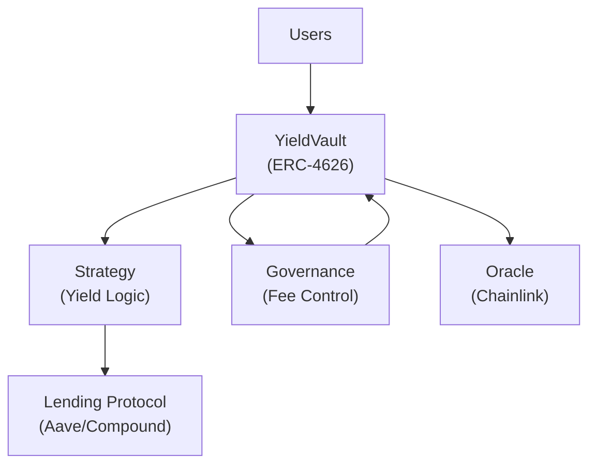
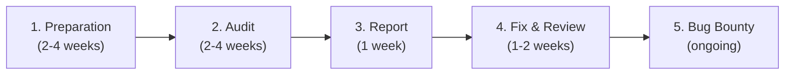

# Module 22 — Audit Readiness

> **Part 6 · Security & Auditing**

---

## Learning Objectives

After completing this module you will be able to:

1. Prepare code for a professional security audit
2. Write clear documentation (NatSpec, architecture diagrams, threat models)
3. Understand the audit process and how to respond to findings
4. Build a security checklist for self-review
5. Create a bug bounty program

---

## 1. Why Audits Matter

Smart contracts are **immutable** and handle **real money**. A single bug can cost millions.

| Protocol | Loss | Cause |
|----------|------|-------|
| The DAO (2016) | $60M | Re-entrancy |
| Poly Network (2021) | $611M | Access control |
| Ronin Bridge (2022) | $625M | Compromised keys |
| Euler Finance (2023) | $197M | Flash loan exploit |

An audit doesn't guarantee zero bugs, but it **dramatically reduces** the risk.

---

## 2. Pre-Audit Checklist

### Code Quality

- [ ] All functions have NatSpec documentation
- [ ] No `TODO` comments or placeholder code
- [ ] Consistent naming conventions (e.g., `_` prefix for internal functions)
- [ ] All state-changing functions emit events
- [ ] Error messages are clear and include context
- [ ] No dead code or unused imports
- [ ] Compiler warnings resolved

### Testing

- [ ] Unit test coverage > 90%
- [ ] Integration tests for all user flows
- [ ] Fuzz tests for arithmetic-heavy functions
- [ ] Invariant tests for critical properties
- [ ] Fork tests against real protocols (if integrating)
- [ ] All tests pass with `-vvvv` (no unexpected traces)

### Security

- [ ] Slither clean (no high/critical findings)
- [ ] Re-entrancy protection on all external calls
- [ ] Access control reviewed on every external function
- [ ] Input validation on all parameters
- [ ] No reliance on `block.timestamp` for randomness
- [ ] Oracle sources are decentralised (Chainlink, TWAP)
- [ ] Upgrade patterns validated (storage layout check)

### Documentation

- [ ] Architecture diagram (contracts and their relationships)
- [ ] Threat model document
- [ ] Deployment script with post-deployment verification steps
- [ ] List of trusted actors and their privileges

---

## 3. Writing Clear Documentation

### NatSpec — Full Example

```solidity
// SPDX-License-Identifier: MIT
pragma solidity ^0.8.24;

/// @title YieldVault — A yield-bearing ERC-4626 vault
/// @author Your Name <you@example.com>
/// @notice Deposit ERC-20 tokens to earn yield from a lending strategy
/// @dev Implements ERC-4626 with additional fee logic and emergency pause
/// @custom:security-contact security@example.com
contract YieldVault {
    /// @notice The underlying token accepted by the vault
    /// @dev Must be a standard ERC-20 (no fee-on-transfer)
    IERC20 public immutable asset;

    /// @notice The fee charged on yield (in basis points, 100 = 1%)
    /// @dev Set by governance, max 1000 (10%)
    uint256 public feeBps;

    /// @notice Deposit assets and receive vault shares
    /// @param assets The amount of underlying tokens to deposit
    /// @param receiver The address that will receive the shares
    /// @return shares The number of shares minted to the receiver
    /// @dev Emits a {Deposit} event
    /// @dev Reverts if the vault is paused
    function deposit(uint256 assets, address receiver) external returns (uint256 shares) {
        // ...
    }
}
```

### Architecture Diagram



### Threat Model Template

```markdown
## Threat Model: YieldVault

### Trust Assumptions
- Governance (multisig) is honest
- Chainlink oracle is accurate
- Aave/Compound are solvent

### Attack Vectors
1. **Re-entrancy in deposit/withdraw** — Mitigated by ReentrancyGuard
2. **Oracle manipulation** — Using Chainlink, not DEX spot
3. **Governance takeover** — Timelock + multisig
4. **Strategy rug pull** — Strategy can only interact with whitelisted protocols
5. **Inflation attack** — Lock minimum liquidity on first deposit

### Out of Scope
- Oracle failure (assumed reliable)
- Underlying protocol insolvency
```

---

## 4. The Audit Process

### Timeline



### What Auditors Look For

| Category | Examples |
|----------|----------|
| **Critical** | Loss of funds, access control bypass, re-entrancy |
| **High** | Unintended token minting, permanent lock of funds |
| **Medium** | Griefing attacks, DoS vectors, centralisation risks |
| **Low** | Gas inefficiencies, event emission gaps |
| **Informational** | Code style, documentation improvements |

### Responding to Findings

```markdown
## Response to Audit Finding #1

### Finding
Re-entrancy in `withdraw()` function — state update after external call.

### Severity
High

### Response
**Fixed.** Applied Checks-Effects-Interactions pattern:
- Moved `balances[msg.sender] -= amount` before the `call`
- Added `nonReentrant` modifier as defense-in-depth

### Commit
abc123def — "Fix re-entrancy in withdraw"
```

---

## 5. Security Review Checklist (Self-Audit)

```solidity
// Review every external function with this checklist:

// 1. ACCESS CONTROL: Who can call this?
// ✓ Only owner? onlyRole? Open to all?

// 2. INPUT VALIDATION: Are all params checked?
// ✓ address != 0? amount > 0? amount <= max?

// 3. STATE CHANGES: Are they before external calls?
// ✓ Checks → Effects → Interactions

// 4. EXTERNAL CALLS: Can they fail gracefully?
// ✓ Use `call` with success check, not `transfer`

// 5. RE-ENTRANCY: Is there a guard?
// ✓ nonReentrant modifier or pull pattern

// 6. EVENTS: Is the state change logged?
// ✓ emit Event(...)

// 7. GAS: Is it optimised for common paths?
// ✓ calldata over memory, unchecked where safe
```

---

## 6. Bug Bounty Programs

### Platforms

| Platform | Description |
|----------|-------------|
| **Immunefi** | Largest Web3 bug bounty platform ($100M+ in bounties) |
| **Code4rena** | Competitive audits with community |
| **Sherlock** | Audit contests + insurance |
| **Hats Finance** | Decentralised bug bounties |

### Bounty Structure

| Severity | Typical Reward |
|----------|---------------|
| Critical | $50,000 - $1,000,000 |
| High | $10,000 - $50,000 |
| Medium | $1,000 - $10,000 |
| Low | $100 - $1,000 |

---

## 7. Mini-Project: Prepare Your Capstone for Audit

Take the YieldVault from Module 23 and:

1. Write complete NatSpec for all functions
2. Create an architecture diagram
3. Write a threat model document
4. Run Slither and fix all High/Critical findings
5. Write a "Known Limitations" section
6. Create a deployment verification script

---

## Checkpoint ✅

1. Write a threat model for a DEX contract (Module 16)
2. Create a self-audit checklist specific to your project
3. Run Slither on a contract and write responses to 3 findings
4. Explain the difference between an audit and a bug bounty

---

## Common Pitfalls

| Pitfall | Clarification |
|---------|---------------|
| "One audit is enough" | Protocols evolve — re-audit after significant changes |
| Ignoring "informational" findings | They often indicate deeper design issues |
| No incident response plan | Have a plan for pausing and emergency withdrawals |
| Hiding audit reports | Transparency builds trust — publish reports publicly |

---

## Further Reading

- [Trail of Bits Audit Handbook](https://github.com/crytic/properties)
- [OpenZeppelin Security Best Practices](https://docs.openzeppelin.com/contracts/5.x/)
- [Immunefi](https://immunefi.com/)
- [Code4rena](https://code4rena.com/)

---

**Previous →** [Module 21: Formal Verification & Static Analysis](./21-formal-verification-static-analysis.md)  
**Next →** [Module 23: Capstone — Full-Stack DeFi Protocol](./23-capstone-defi-protocol.md)
