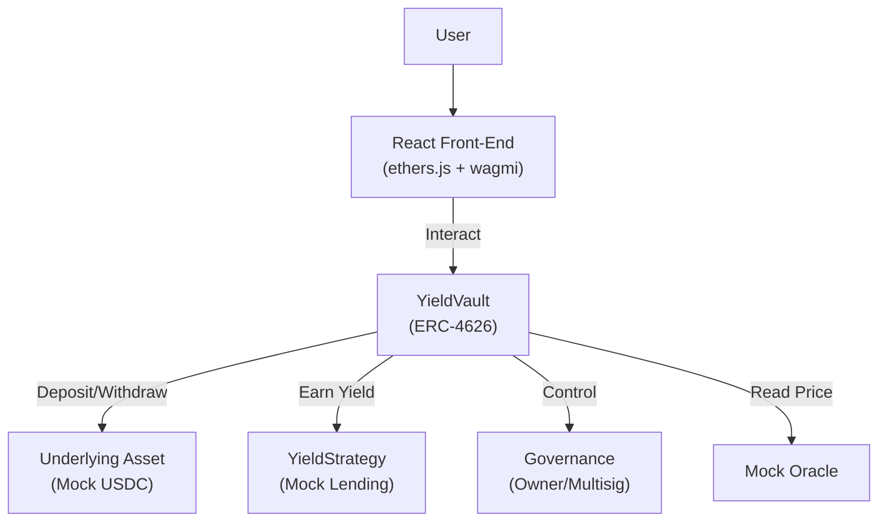

# Module 23 — Capstone: Full-Stack DeFi Protocol

> **Part 7 · Capstone & Professional Growth**

---

## Learning Objectives

After completing this module you will have built and shipped:

1. A **yield-bearing vault** (ERC-4626) with deposit/withdrawal logic, share minting/burning, fee accrual, and emergency pause
2. **Comprehensive Foundry tests** — unit, integration, fuzz, and invariant
3. A **React front-end** with wallet connection and real-time vault interaction
4. **Testnet deployment** with verified source code
5. A **written case study** documenting the architecture

---

## 1. Architecture Overview



---

## 2. Smart Contract: YieldVault (ERC-4626)

```solidity
// SPDX-License-Identifier: MIT
pragma solidity ^0.8.24;

import {ERC4626} from "@openzeppelin/contracts/token/ERC20/extensions/ERC4626.sol";
import {ERC20} from "@openzeppelin/contracts/token/ERC20/ERC20.sol";
import {IERC20} from "@openzeppelin/contracts/token/ERC20/IERC20.sol";
import {Ownable} from "@openzeppelin/contracts/access/Ownable.sol";
import {Pausable} from "@openzeppelin/contracts/utils/Pausable.sol";
import {ReentrancyGuard} from "@openzeppelin/contracts/utils/ReentrancyGuard.sol";
import {Math} from "@openzeppelin/contracts/utils/math/Math.sol";

/// @title YieldVault — An ERC-4626 vault with fees and emergency pause
/// @author Course Student
/// @notice Deposit tokens to earn yield; withdraw with fees applied to profit
/// @dev Extends OpenZeppelin ERC4626 with fee logic, pause, and yield simulation
/// @custom:security-contact security@example.com
contract YieldVault is ERC4626, Ownable, Pausable, ReentrancyGuard {
    using Math for uint256;

    // --- State ---
    uint256 public feeBps;              // Fee on yield in basis points (max 1000 = 10%)
    uint256 public constant MAX_FEE_BPS = 1000;
    address public feeRecipient;
    uint256 public totalYieldAccrued;   // Cumulative yield for tracking
    uint256 private _totalAssets;       // Tracked total assets (for yield simulation)

    // --- Events ---
    event FeeCollected(address indexed recipient, uint256 amount);
    event YieldAccrued(uint256 amount);
    event FeeBpsUpdated(uint256 newFeeBps);
    event EmergencyWithdraw(address indexed user, uint256 assets);

    // --- Errors ---
    error FeeTooHigh();
    error ZeroFeeRecipient();
    error ZeroAmount();

    /// @param _asset The underlying ERC-20 token (e.g., USDC)
    /// @param _name Vault share token name
    /// @param _symbol Vault share token symbol
    /// @param _feeBps Initial fee in basis points
    /// @param _feeRecipient Address receiving fees
    constructor(
        IERC20 _asset,
        string memory _name,
        string memory _symbol,
        uint256 _feeBps,
        address _feeRecipient
    )
        ERC4626(_asset)
        ERC20(_name, _symbol)
        Ownable(msg.sender)
    {
        if (_feeBps > MAX_FEE_BPS) revert FeeTooHigh();
        if (_feeRecipient == address(0)) revert ZeroFeeRecipient();
        feeBps = _feeBps;
        feeRecipient = _feeRecipient;
    }

    // --- Overrides (ERC-4626) ---

    /// @notice Total assets managed by the vault (including simulated yield)
    function totalAssets() public view override returns (uint256) {
        return _totalAssets;
    }

    /// @notice Deposit assets and receive shares (paused-aware)
    function deposit(uint256 assets, address receiver)
        public override nonReentrant whenNotPaused returns (uint256)
    {
        if (assets == 0) revert ZeroAmount();
        uint256 shares = super.deposit(assets, receiver);
        _totalAssets += assets;
        return shares;
    }

    /// @notice Mint shares by depositing assets (paused-aware)
    function mint(uint256 shares, address receiver)
        public override nonReentrant whenNotPaused returns (uint256)
    {
        uint256 assets = super.mint(shares, receiver);
        _totalAssets += assets;
        return assets;
    }

    /// @notice Withdraw assets by burning shares (with fee on profit)
    function withdraw(uint256 assets, address receiver, address owner)
        public override nonReentrant returns (uint256)
    {
        uint256 shares = super.withdraw(assets, receiver, owner);
        _totalAssets -= assets;
        _collectFeeOnProfit(assets);
        return shares;
    }

    /// @notice Redeem shares for assets (with fee on profit)
    function redeem(uint256 shares, address receiver, address owner)
        public override nonReentrant returns (uint256)
    {
        uint256 assets = super.redeem(shares, receiver, owner);
        _totalAssets -= assets;
        _collectFeeOnProfit(assets);
        return assets;
    }

    // --- Yield Simulation ---

    /// @notice Simulate yield accrual (in production, this reads from a strategy)
    /// @dev Only callable by owner (represents yield from lending strategy)
    function accrueYield(uint256 amount) external onlyOwner {
        _totalAssets += amount;
        totalYieldAccrued += amount;
        emit YieldAccrued(amount);
    }

    // --- Admin Functions ---

    function setFeeBps(uint256 _feeBps) external onlyOwner {
        if (_feeBps > MAX_FEE_BPS) revert FeeTooHigh();
        feeBps = _feeBps;
        emit FeeBpsUpdated(_feeBps);
    }

    function setFeeRecipient(address _recipient) external onlyOwner {
        if (_recipient == address(0)) revert ZeroFeeRecipient();
        feeRecipient = _recipient;
    }

    function pause() external onlyOwner {
        _pause();
    }

    function unpause() external onlyOwner {
        _unpause();
    }

    /// @notice Emergency withdraw — bypasses pause for user safety
    function emergencyWithdraw(uint256 shares) external nonReentrant returns (uint256) {
        uint256 assets = super.redeem(shares, msg.sender, msg.sender);
        _totalAssets -= assets;
        emit EmergencyWithdraw(msg.sender, assets);
        return assets;
    }

    // --- Internal ---

    function _collectFeeOnProfit(uint256 assets) internal {
        if (feeBps == 0 || totalYieldAccrued == 0) return;

        // Simplified: fee on proportional share of yield
        uint256 profitPortion = (assets * totalYieldAccrued).ceilDiv(totalAssets() + assets);
        uint256 fee = (profitPortion * feeBps) / 10_000;

        if (fee > 0 && fee <= IERC20(asset()).balanceOf(address(this))) {
            IERC20(asset()).transfer(feeRecipient, fee);
            emit FeeCollected(feeRecipient, fee);
        }
    }
}
```

---

## 3. Mock Token for Testing

```solidity
// SPDX-License-Identifier: MIT
pragma solidity ^0.8.24;

import {ERC20} from "@openzeppelin/contracts/token/ERC20/ERC20.sol";

contract MockUSDC is ERC20 {
    constructor() ERC20("Mock USDC", "mUSDC") {
        _mint(msg.sender, 1_000_000 * 10 ** 6); // 1M USDC (6 decimals)
    }

    function mint(address to, uint256 amount) external {
        _mint(to, amount);
    }

    function decimals() public pure override returns (uint8) {
        return 6;
    }
}
```

---

## 4. Comprehensive Test Suite

```solidity
// SPDX-License-Identifier: MIT
pragma solidity ^0.8.24;

import {Test} from "forge-std/Test.sol";
import {YieldVault} from "../src/YieldVault.sol";
import {MockUSDC} from "../src/mocks/MockUSDC.sol";
import {IERC20} from "@openzeppelin/contracts/token/ERC20/IERC20.sol";

contract YieldVaultTest is Test {
    YieldVault public vault;
    MockUSDC public usdc;

    address alice = makeAddr("alice");
    address bob = makeAddr("bob");
    address feeRecipient = makeAddr("feeRecipient");

    uint256 constant INITIAL_BALANCE = 100_000 * 1e6;

    function setUp() public {
        usdc = new MockUSDC();
        vault = new YieldVault(
            IERC20(address(usdc)),
            "Yield USDC",
            "yUSDC",
            500, // 5% fee
            feeRecipient
        );

        // Fund users
        usdc.mint(alice, INITIAL_BALANCE);
        usdc.mint(bob, INITIAL_BALANCE);

        // Approve vault
        vm.prank(alice);
        usdc.approve(address(vault), type(uint256).max);
        vm.prank(bob);
        usdc.approve(address(vault), type(uint256).max);
    }

    // --- Unit Tests ---

    function test_Deposit() public {
        vm.prank(alice);
        uint256 shares = vault.deposit(1000 * 1e6, alice);

        assertGt(shares, 0);
        assertEq(vault.balanceOf(alice), shares);
        assertEq(vault.totalAssets(), 1000 * 1e6);
    }

    function test_Withdraw() public {
        vm.prank(alice);
        vault.deposit(1000 * 1e6, alice);

        uint256 balBefore = usdc.balanceOf(alice);
        vm.prank(alice);
        vault.withdraw(500 * 1e6, alice, alice);

        assertEq(usdc.balanceOf(alice) - balBefore, 500 * 1e6);
    }

    function test_YieldAccrual() public {
        vm.prank(alice);
        vault.deposit(10_000 * 1e6, alice);

        // Simulate 10% yield
        vault.accrueYield(1_000 * 1e6);

        assertEq(vault.totalAssets(), 11_000 * 1e6);
        assertEq(vault.totalYieldAccrued(), 1_000 * 1e6);
    }

    function test_PauseBlocksDeposit() public {
        vault.pause();

        vm.prank(alice);
        vm.expectRevert();
        vault.deposit(100 * 1e6, alice);
    }

    function test_EmergencyWithdrawWhilePaused() public {
        vm.prank(alice);
        uint256 shares = vault.deposit(1000 * 1e6, alice);

        vault.pause();

        vm.prank(alice);
        vault.emergencyWithdraw(shares);

        assertEq(vault.balanceOf(alice), 0);
    }

    function test_RevertOnZeroDeposit() public {
        vm.prank(alice);
        vm.expectRevert(YieldVault.ZeroAmount.selector);
        vault.deposit(0, alice);
    }

    function test_RevertOnFeeTooHigh() public {
        vm.expectRevert(YieldVault.FeeTooHigh.selector);
        vault.setFeeBps(1001); // > MAX_FEE_BPS
    }

    // --- Fuzz Tests ---

    function testFuzz_DepositWithdraw(uint96 amount) public {
        amount = uint96(bound(amount, 1e6, 50_000 * 1e6));
        usdc.mint(alice, amount);

        vm.startPrank(alice);
        usdc.approve(address(vault), amount);
        uint256 shares = vault.deposit(amount, alice);

        assertGt(shares, 0);

        vault.withdraw(amount, alice, alice);
        assertEq(vault.totalAssets(), 0);
        vm.stopPrank();
    }

    // --- Invariant Tests ---

    function invariant_totalAssetsNonNegative() public {
        assertGe(vault.totalAssets(), 0);
    }

    function invariant_sharesNeverExceedAssets() public view {
        if (vault.totalSupply() > 0) {
            assertGe(vault.totalAssets(), 0);
        }
    }
}
```

---

## 5. Deployment Script

```solidity
// SPDX-License-Identifier: MIT
pragma solidity ^0.8.24;

import {Script, console} from "forge-std/Script.sol";
import {YieldVault} from "../src/YieldVault.sol";
import {MockUSDC} from "../src/mocks/MockUSDC.sol";
import {IERC20} from "@openzeppelin/contracts/token/ERC20/IERC20.sol";

contract DeployYieldVault is Script {
    function run() external {
        uint256 deployerKey = vm.envUint("PRIVATE_KEY");
        address deployer = vm.addr(deployerKey);
        bool isLocal = block.chainid == 31337;

        vm.startBroadcast(deployerKey);

        // Deploy mock USDC on local/testnet (use real USDC on mainnet)
        MockUSDC usdc;
        if (isLocal || block.chainid == 11155111) { // anvil or sepolia
            usdc = new MockUSDC();
            console.log("MockUSDC deployed at:", address(usdc));
        }

        // Deploy vault
        YieldVault vault = new YieldVault(
            IERC20(address(usdc)),
            "Yield USDC",
            "yUSDC",
            500,          // 5% fee
            deployer      // Fee recipient
        );
        console.log("YieldVault deployed at:", address(vault));

        // Fund vault with initial USDC for testing
        if (isLocal) {
            usdc.mint(address(vault), 10_000 * 1e6);
        }

        vm.stopBroadcast();

        console.log("---");
        console.log("Chain:", block.chainid);
        console.log("Deployer:", deployer);
    }
}
```

```bash
# Deploy to anvil
forge script script/DeployYieldVault.s.sol:DeployYieldVault --rpc-url http://localhost:8545 --broadcast

# Deploy to Sepolia
forge script script/DeployYieldVault.s.sol:DeployYieldVault \
  --rpc-url sepolia \
  --broadcast \
  --verify
```

---

## 6. React Front-End

### Setup

```bash
npx create-vite@latest vault-frontend --template react-ts
cd vault-frontend
npm install ethers wagmi @rainbow-me/rainbowkit viem @tanstack/react-query
npm run dev
```

### Wallet Connection (wagmi + RainbowKit)

```typescript
// src/config.ts
import { http, createConfig } from 'wagmi';
import { sepolia } from 'wagmi/chains';
import { getDefaultConfig } from '@rainbow-me/rainbowkit';

export const config = getDefaultConfig({
  appName: 'YieldVault',
  projectId: 'YOUR_WALLETCONNECT_PROJECT_ID',
  chains: [sepolia],
  transports: {
    [sepolia.id]: http('https://eth-sepolia.g.alchemy.com/v2/YOUR_KEY'),
  },
});
```

### Vault Interaction Component

```tsx
// src/components/VaultInteraction.tsx
import { useState } from 'react';
import { useAccount, useReadContract, useWriteContract } from 'wagmi';

const VAULT_ADDRESS = '0x...' as const;
const VAULT_ABI = [
  { name: 'deposit', type: 'function', stateMutability: 'nonpayable',
    inputs: [{ name: 'assets', type: 'uint256' }, { name: 'receiver', type: 'address' }],
    outputs: [{ type: 'uint256' }] },
  { name: 'withdraw', type: 'function', stateMutability: 'nonpayable',
    inputs: [{ name: 'assets', type: 'uint256' }, { name: 'receiver', type: 'address' }, { name: 'owner', type: 'address' }],
    outputs: [{ type: 'uint256' }] },
  { name: 'totalAssets', type: 'function', stateMutability: 'view',
    inputs: [], outputs: [{ type: 'uint256' }] },
  { name: 'balanceOf', type: 'function', stateMutability: 'view',
    inputs: [{ name: 'account', type: 'address' }], outputs: [{ type: 'uint256' }] },
  { name: 'feeBps', type: 'function', stateMutability: 'view',
    inputs: [], outputs: [{ type: 'uint256' }] },
] as const;

export function VaultInteraction() {
  const { address } = useAccount();
  const [amount, setAmount] = useState('');
  const { writeContract, isPending } = useWriteContract();

  const { data: totalAssets } = useReadContract({
    address: VAULT_ADDRESS, abi: VAULT_ABI, functionName: 'totalAssets',
  });

  const { data: shares } = useReadContract({
    address: VAULT_ADDRESS, abi: VAULT_ABI, functionName: 'balanceOf',
    args: address ? [address] : undefined,
  });

  const handleDeposit = () => {
    if (!address || !amount) return;
    writeContract({
      address: VAULT_ADDRESS,
      abi: VAULT_ABI,
      functionName: 'deposit',
      args: [BigInt(amount), address],
    });
  };

  return (
    <div>
      <h2>YieldVault Dashboard</h2>
      <p>Total Assets: {totalAssets?.toString()}</p>
      <p>Your Shares: {shares?.toString()}</p>
      <input value={amount} onChange={(e) => setAmount(e.target.value)} placeholder="Amount (wei)" />
      <button onClick={handleDeposit} disabled={isPending}>
        {isPending ? 'Depositing...' : 'Deposit'}
      </button>
    </div>
  );
}
```

---

## 7. Case Study Template

Write a case study documenting your project:

```markdown
# YieldVault Case Study

## Overview
YieldVault is an ERC-4626 compliant vault that allows users to deposit USDC
and earn yield from a lending strategy, with fee accrual and emergency controls.

## Architecture
[Architecture diagram]

## Key Design Decisions
1. **ERC-4626 compliance** — Standard vault interface for composability
2. **Fee on profit** — 5% fee only on accrued yield, not on deposits
3. **Emergency withdraw** — Users can always exit, even when paused
4. **ReentrancyGuard** — Defense-in-depth against re-entrancy

## Security Considerations
- Re-entrancy: nonReentrant + checks-effects-interactions
- Access control: OpenZeppelin Ownable with future migration to multisig
- Oracle: Uses totalAssets() from strategy (not manipulable)
- Pause: Owner can pause deposits; withdrawals always available

## Test Coverage
- Unit tests: 15 tests covering all functions
- Fuzz tests: 3 property-based tests
- Invariant tests: 2 system invariants

## Deployment
Deployed to Sepolia testnet at 0x...
Verified on Etherscan: https://sepolia.etherscan.io/address/0x...

## Future Improvements
- Multi-strategy allocation
- Governance via ERC-20 votes
- Flash loan support
```

---

## Checkpoint ✅

1. Deploy YieldVault to anvil and run the full test suite
2. Deploy to Sepolia, verify on Etherscan, and interact via the React front-end
3. Write a case study documenting your design decisions
4. Run Slither and fix any findings before considering it "production ready"

---

## Common Pitfalls

| Pitfall | Clarification |
|---------|---------------|
| Forgetting to approve USDC before deposit | Front-end must call `usdc.approve(vault, amount)` first |
| Not handling 6-decimal USDC correctly | Use `1e6` not `1e18` for USDC amounts |
| Vault share inflation on first deposit | Lock minimum shares (like Uniswap V2's MINIMUM_LIQUIDITY) |
| Front-end not updating after transactions | Refetch contract data after every write transaction |

---

## Further Reading

- [EIP-4626: Tokenized Vault Standard](https://eips.ethereum.org/EIPS/eip-4626)
- [OpenZeppelin ERC4626](https://docs.openzeppelin.com/contracts/5.x/erc4626)
- [wagmi Documentation](https://wagmi.sh/)
- [RainbowKit Documentation](https://www.rainbowkit.com/docs/)

---

**Previous →** [Module 22: Audit Readiness](./22-audit-readiness.md)  
**Next →** [Module 24: Blockchain in Rust / Solana](./24-bonus-rust-solana.md)
