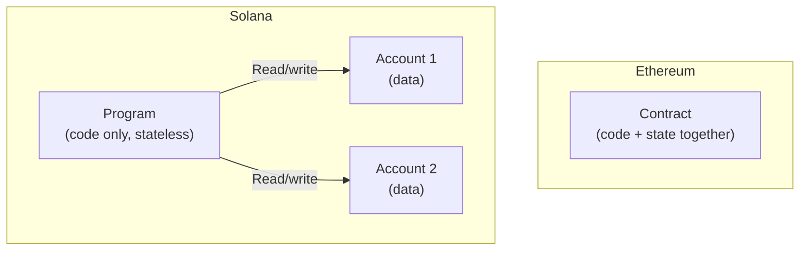

# Module 24 — Bonus: Blockchain in Rust / Solana

> **Bonus Module — Cross-Chain Awareness**

---

## Learning Objectives

After completing this module you will be able to:

1. Explain why Rust is popular for blockchain development
2. Understand Solana's account-based programming model (vs EVM's contract model)
3. Work with PDAs (Program Derived Addresses)
4. Build a simple counter program with the Anchor framework
5. Compare Solana's architecture with Ethereum's EVM

---

## 1. Why Rust for Blockchain?

| Feature | Rust | Solidity |
|---------|------|----------|
| Memory safety | Compile-time guarantees (no GC) | Runtime checks (EVM) |
| Performance | Native speed | Interpreted (EVM bytecode) |
| Type system | Rich (enums, traits, pattern matching) | Limited |
| Concurrency | Fearless concurrency (ownership) | Single-threaded (EVM) |
| Learning curve | Steep | Moderate |
| Use cases | Solana, Cosmos, Polkadot, NEAR | Ethereum + EVM chains |

### Rust Crash Course (30 seconds)

```rust
// Ownership: each value has one owner
let s1 = String::from("hello");
let s2 = s1; // s1 is MOVED to s2 — s1 is now invalid

// Borrowing: pass references without transferring ownership
fn print(s: &String) {
    println!("{}", s);
}
print(&s2); // s2 is borrowed, not moved

// Pattern matching
enum Coin { Heads, Tails }
match flip() {
    Coin::Heads => println!("Heads!"),
    Coin::Tails => println!("Tails!"),
}

// Result type (error handling)
fn divide(a: f64, b: f64) -> Result<f64, String> {
    if b == 0.0 { Err("Division by zero".into()) }
    else { Ok(a / b) }
}
```

---

## 2. Solana Architecture (vs Ethereum)

| Feature | Ethereum (EVM) | Solana |
|---------|---------------|--------|
| Consensus | Proof of Stake | Proof of History + Proof of Stake |
| Block time | ~12 seconds | ~400ms |
| TPS | ~15-30 | ~3,000-10,000 |
| Smart contracts | Solidity / Vyper | Rust (or C/C++) |
| State model | Account-based (contract holds state) | **Separate accounts for code and data** |
| Gas model | Gas per operation | Transaction fee (flat + priority) |
| VM | EVM | BPF (Berkeley Packet Filter) |

### Key Difference: Accounts



On Solana, **programs are stateless**. All state lives in separate accounts that programs read from and write to. This is more like a traditional database model.

---

## 3. PDAs — Program Derived Addresses

PDAs are addresses **not controlled by a private key** — they're derived deterministically from seeds + a program ID.

```rust
// Derive a PDA from seeds
let (pda, bump) = Pubkey::find_program_address(
    &[b"counter", user.key.as_ref()], // Seeds
    program_id                         // Program ID
);
// pda: deterministic address
// bump: the "bump seed" that makes it a valid PDA
```

**Use cases:**
- Store per-user state (counter, vault, user profile)
- Act as program-controlled escrow accounts
- Map seeds → addresses (like Solidity's `mapping`)

---

## 4. Anchor Framework — Solana's "Foundry"

[Anchor](https://www.anchor-lang.com/) is the most popular Solana development framework. It provides:
- Macros for account validation
- IDL (Interface Definition Language) generation
- Client libraries for testing

### Setup

```bash
# Install Rust
curl --proto '=https' --tlsv1.2 -sSf https://sh.rustup.rs | sh

# Install Solana CLI
sh -c "$(curl -sSfL https://release.anza.xyz/stable/install)"

# Install Anchor
cargo install --git https://github.com/coral-xyz/anchor avm --force
avm install latest
avm use latest

# Create project
anchor init solana_counter
cd solana_counter
```

---

## 5. Building a Counter Program

```rust
// programs/counter/src/lib.rs
use anchor_lang::prelude::*;

declare_id!("YourProgramIdHere...");

#[program]
pub mod counter {
    use super::*;

    /// Initialize a new counter for a user
    pub fn initialize(ctx: Context<Initialize>) -> Result<()> {
        let counter = &mut ctx.accounts.counter;
        counter.count = 0;
        counter.authority = ctx.accounts.authority.key();
        msg!("Counter initialized with count: {}", counter.count);
        Ok(())
    }

    /// Increment the counter
    pub fn increment(ctx: Context<Increment>) -> Result<()> {
        let counter = &mut ctx.accounts.counter;
        counter.count += 1;
        msg!("Counter incremented to: {}", counter.count);
        Ok(())
    }

    /// Reset the counter (only authority)
    pub fn reset(ctx: Context<Reset>) -> Result<()> {
        let counter = &mut ctx.accounts.counter;
        counter.count = 0;
        msg!("Counter reset");
        Ok(())
    }
}

// --- Account Validation ---

#[derive(Accounts)]
pub struct Initialize<'info> {
    #[account(
        init,
        payer = authority,
        space = 8 + Counter::INIT_SPACE, // 8 = discriminator
        seeds = [b"counter", authority.key().as_ref()],
        bump
    )]
    pub counter: Account<'info, Counter>,

    #[account(mut)]
    pub authority: Signer<'info>,

    pub system_program: Program<'info, System>,
}

#[derive(Accounts)]
pub struct Increment<'info> {
    #[account(
        mut,
        seeds = [b"counter", authority.key().as_ref()],
        bump = counter.bump,
        has_one = authority
    )]
    pub counter: Account<'info, Counter>,

    pub authority: Signer<'info>,
}

#[derive(Accounts)]
pub struct Reset<'info> {
    #[account(
        mut,
        seeds = [b"counter", authority.key().as_ref()],
        bump = counter.bump,
        has_one = authority  // Only the authority can reset
    )]
    pub counter: Account<'info, Counter>,

    pub authority: Signer<'info>,
}

// --- Data Structures ---

#[account]
#[derive(InitSpace)]
pub struct Counter {
    pub count: u64,
    pub authority: Pubkey,
    pub bump: u8,
}
```

---

## 6. Testing with Anchor

```rust
// tests/counter.ts
import * as anchor from "@coral-xyz/anchor";
import { Program } from "@coral-xyz/anchor";
import { Counter } from "../target/types/counter";

describe("counter", () => {
  const provider = anchor.AnchorProvider.env();
  anchor.setProvider(provider);
  const program = anchor.workspace.Counter as Program<Counter>;
  const authority = provider.wallet;

  // Derive the counter PDA
  const [counterPda] = anchor.web3.PublicKey.findProgramAddressSync(
    [Buffer.from("counter"), authority.publicKey.toBuffer()],
    program.programId
  );

  it("Initializes a counter", async () => {
    await program.methods
      .initialize()
      .accounts({ counter: counterPda, authority: authority.publicKey })
      .rpc();

    const counter = await program.account.counter.fetch(counterPda);
    console.log("Count:", counter.count.toString());
    expect(counter.count.toNumber()).toBe(0);
  });

  it("Increments the counter", async () => {
    await program.methods
      .increment()
      .accounts({ counter: counterPda, authority: authority.publicKey })
      .rpc();

    const counter = await program.account.counter.fetch(counterPda);
    expect(counter.count.toNumber()).toBe(1);
  });

  it("Resets the counter", async () => {
    await program.methods
      .increment().increment().increment() // +3
      .accounts({ counter: counterPda, authority: authority.publicKey })
      .rpc();

    await program.methods
      .reset()
      .accounts({ counter: counterPda, authority: authority.publicKey })
      .rpc();

    const counter = await program.account.counter.fetch(counterPda);
    expect(counter.count.toNumber()).toBe(0);
  });
});
```

### Run Tests

```bash
# Start local validator
solana-test-validator &

# Run tests
anchor test
```

---

## 7. EVM vs Solana — Side-by-Side Comparison

| Concept | EVM (Solidity) | Solana (Anchor/Rust) |
|---------|----------------|----------------------|
| State storage | Contract storage slots | Separate accounts |
| Address derivation | `keccak256(sender, nonce)` | PDA from seeds |
| Access control | `msg.sender` + modifiers | `Signer` account validation |
| Events | `emit Event(...)` | `msg!()` + instruction logs |
| Token standard | ERC-20 (contract) | SPL Token (program) |
| Cross-contract calls | `call` / `delegatecall` | CPI (Cross-Program Invocation) |
| Upgradeable | Proxy patterns | BPF loader upgradeable |
| Testing | Foundry forge test | `anchor test` |

### When to Use Which?

| Use Case | Best Choice |
|----------|-------------|
| DeFi (mature ecosystem) | Ethereum / EVM |
| High-frequency trading | Solana |
| NFTs (established marketplace) | Ethereum |
| Gaming / micro-transactions | Solana |
| Cross-chain bridges | Both (depending on endpoints) |
| Enterprise / permissioned | Consider Cosmos (Rust) or Hyperledger |

---

## 8. Beyond Solana — Other Rust Blockchains

| Chain | Language | VM | Notes |
|-------|----------|-----|-------|
| **Polkadot** (Substrate) | Rust | Wasm | Build custom blockchains |
| **Cosmos** (CosmWasm) | Rust | Wasm | Interchain (IBC) messaging |
| **NEAR** | Rust / JavaScript | Wasm | User-friendly, sharded |
| **Aptos** | Move | Move VM | Facebook Libra heritage |
| **Sui** | Move | Move VM | Object-centric model |

---

## Checkpoint ✅

1. Install Rust, Solana CLI, and Anchor
2. Create the counter program, deploy to localnet, and run tests
3. Add a `decrement` instruction to the counter
4. Explain PDAs to someone who only knows Ethereum

---

## Common Pitfalls

| Pitfall | Clarification |
|---------|---------------|
| Forgetting to pass all accounts | Solana requires explicit account passing (no implicit state access) |
| Not allocating enough space | Calculate `8 + INIT_SPACE` for Anchor accounts |
| Bump seed not stored | Store bump in account data to avoid recomputing |
| Confusing `Signer` and `Account` | `Signer` proves authority; `Account` holds data |

---

## Further Reading

- [Anchor Book](https://www.anchor-lang.com/docs)
- [Solana Cookbook](https://solanacookbook.com/)
- [Rust Book](https://doc.rust-lang.org/book/)
- [Solana vs Ethereum comparison](https://solana.com/news/solana-vs-ethereum)

---

**Previous →** [Module 23: Capstone — Full-Stack DeFi Protocol](./23-capstone-defi-protocol.md)  
**Next →** [Appendix: EVM Job Landscape & Skills Roadmap](./appendix-evm-job-landscape.md)
