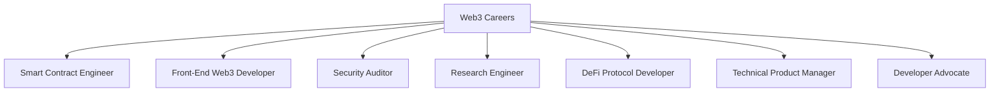

# Appendix — EVM Job Landscape & Skills Roadmap

---

## 1. Career Paths in Web3



### Role Breakdown

| Role | Key Skills | Experience Needed | Salary Range (USD) |
|------|-----------|-------------------|---------------------|
| **Smart Contract Engineer** | Solidity, Foundry, EVM, gas optimisation | 1-3 years | $120k - $250k |
| **Senior SC Engineer** | Architecture, security, auditing, leadership | 3-5+ years | $200k - $400k |
| **Security Auditor** | Vulnerability patterns, formal verification, Slither | 2-4 years | $150k - $350k |
| **DeFi Developer** | AMMs, lending, yield strategies, MEV | 2-4 years | $140k - $300k |
| **Web3 Front-End** | ethers.js, wagmi, React, wallet UX | 1-2 years | $100k - $180k |
| **Protocol Researcher** | Cryptography, game theory, economics | PhD often | $160k - $350k |
| **DevRel / Developer Advocate** | Communication, teaching, Solidity | 2+ years | $120k - $220k |

---

## 2. Skills Roadmap

### Beginner (0-6 months)

```
[ ] Complete Modules 1-8 of this course
[ ] Understand blockchain fundamentals and consensus
[ ] Write basic Solidity contracts
[ ] Deploy to testnet
[ ] Use Foundry (forge, cast, anvil)
[ ] Build a simple dApp (contract + front-end)
[ ] Understand ERC-20 and ERC-721 standards
```

### Intermediate (6-18 months)

```
[ ] Complete Modules 9-17
[ ] Write comprehensive Foundry test suites
[ ] Implement DeFi primitives (AMM, lending)
[ ] Understand upgradeable contract patterns
[ ] Optimise gas on real contracts
[ ] Contribute to open-source (OpenZeppelin, protocols)
[ ] Build a portfolio of 3-5 projects
[ ] Participate in audit contests (Code4rena, Sherlock)
```

### Senior (18+ months)

```
[ ] Complete Modules 18-24
[ ] Lead smart contract architecture decisions
[ ] Conduct security reviews and write audit reports
[ ] Understand cross-chain and L2 deployment strategies
[ ] Mentor junior engineers
[ ] Speak at conferences or write technical blog posts
[ ] Build or contribute to a production protocol
```

---

## 3. Building Your Portfolio

### What Recruiters Look For

1. **GitHub profile** — public repos with clean, tested code
2. **Deployed contracts** — verified on Etherscan with real users or testnet activity
3. **Audit contest participation** — findings on Code4rena, Sherlock
4. **Technical writing** — blog posts explaining complex topics simply
5. **Open-source contributions** — PRs to major protocols

### Portfolio Projects to Build

| Project | Skills Demonstrated |
|---------|-------------------|
| ERC-20 token with vesting | Token standards, access control |
| NFT marketplace | Complex state, escrow, events |
| DeFi vault (ERC-4626) | Yield strategies, share math |
| DEX (constant product) | AMM math, LP tokens, slippage |
| Multi-sig wallet | Security patterns, governance |
| Cross-chain messaging | L2, bridges, LayerZero |

### GitHub Best Practices

- **README** with architecture diagram, setup instructions, and screenshots
- **Tests** — visible test count and coverage
- **CI/CD** — green badge showing passing tests
- **Clean commits** — meaningful messages, logical grouping
- **Documentation** — NatSpec on every contract

---

## 4. Interview Preparation

### Common Interview Topics

| Topic | Sample Questions |
|-------|-----------------|
| **Solidity fundamentals** | Storage vs memory, visibility, `delegatecall` vs `call` |
| **EVM internals** | How does `SSTORE` work? What is a storage slot? |
| **Security** | Explain re-entrancy. How do you prevent it? |
| **DeFi** | How does a constant product AMM work? |
| **Gas optimisation** | How would you optimise this contract? |
| **Design patterns** | Proxy patterns, diamond standard, access control |
| **Tooling** | Walk me through your Foundry testing workflow |
| **Live coding** | Implement an ERC-20 `transfer` function from scratch |

### Coding Challenge Practice

```solidity
// Practice: Implement a timelock contract
// - Owner can queue transactions
// - Transactions execute after a delay (e.g., 48 hours)
// - Owner can cancel queued transactions
// - Emergency: owner can execute immediately in emergencies

// Practice: Implement a merkle airdrop
// - Users claim tokens by providing a proof
// - Each address can claim once
// - Use OpenZeppelin MerkleProof

// Practice: Implement a simple DCA (Dollar Cost Averaging) contract
// - Users schedule recurring buys
// - Contract swaps at each interval using a DEX
// - Users withdraw accumulated tokens
```

### System Design Interview

**Prompt:** "Design a decentralised lending protocol."

```markdown
## Architecture
- Core contracts: LendingPool, InterestRateModel, Oracle, Liquidator
- Token: aTokens (receipt tokens, 1:1 with deposits)

## Key Features
- Overcollateralised borrowing
- Variable interest rates (utilisation-based)
- Liquidation with bonus incentive
- Flash loans

## Security Considerations
- Oracle: Chainlink with staleness check
- Re-entrancy: ReentrancyGuard on all state-changing functions
- Access control: Role-based (admin, risk manager, emergency)
- Upgradeable: UUPS proxy with timelock governance

## Testing Strategy
- Unit tests: All functions
- Fuzz: Interest rate calculations
- Invariant: totalDeposits >= totalBorrows (accounting for interest)
- Fork: Integration with real Chainlink + Aave
```

---

## 5. Where to Find Jobs

### Job Boards

| Platform | Type |
|----------|------|
| [Web3.career](https://web3.career) | Largest Web3 job board |
| [CryptoJobsList](https://cryptosjobslist.com) | Curated listings |
| [DeFi Jobs](https://defi.jobs) | DeFi-specific |
| [Ethereum Foundation](https://ethereum.org/en/about/#jobs) | Foundation roles |
| [Remote3](https://remote3.co) | Remote Web3 jobs |

### Communities

| Community | Value |
|-----------|-------|
| **Ethereum Dev Discord** | Networking, job postings |
| **Foundry Telegram** | Tooling help, hiring |
| **Code4rena** | Audit contests → auditor pipeline |
| **ETHGlobal Hackathons** | Meet teams, build projects |
| **Local meetups** | In-person networking |

### Conferences

| Event | When |
|-------|------|
| **ETH Denver** | February |
| **ETH Global Hackathons** | Monthly |
| **Devcon** | Every 2 years |
| **Consensus** | May |
| **SmartCon (Chainlink)** | November |

---

## 6. Salary Negotiation Tips

1. **Know your worth** — check [levels.fyi/crypto](https://www.levels.fyi/comp.html?track=web3)
2. **Token compensation** — understand vesting, cliff, and token liquidity
3. **Total comp** = base salary + tokens + bonuses + benefits
4. **Remote premium** — many Web3 roles are remote-first
5. **Equity vs tokens** — tokens are liquid but volatile; equity is illiquid but potentially more valuable

---

## 7. Continuous Learning Resources

### Podcasts

- **Uncommon Core** — Technical deep dives
- **Bankless** — DeFi and Web3 trends
- **The Defiant** — DeFi news and analysis

### Newsletters

- **Week in Ethereum** — Weekly Ethereum ecosystem updates
- **Solidity Weekly** — Compiler and language updates
- **Rekt News** — Hack analysis and lessons

### YouTube

- **Patrick Collins** — In-depth Solidity courses
- **EatTheBlocks** — Tutorials and project walkthroughs
- **Smart Contract Programmer** — Bite-sized Solidity tips

### Books

- *Mastering Ethereum* — Andreas Antonopoulos (free online)
- *Hands-On Smart Contract Development* — Kevin Solorio
- *Programming Bitcoin* — Jimmy Song (for Bitcoin fundamentals)

---

## 8. Your First 90 Days as a Smart Contract Engineer

| Week | Focus |
|------|-------|
| 1-2 | Read the codebase, understand architecture, set up dev environment |
| 3-4 | Fix small bugs, write tests, understand testing patterns |
| 5-8 | Take on medium-complexity features, start reviewing PRs |
| 9-12 | Own a feature end-to-end, participate in security discussions |
| 13+ | Start mentoring, contribute to architecture decisions |

---

*This course is your foundation. The real learning happens when you ship to production, respond to incidents, and build alongside a team. Go build something meaningful.*

---

**Back to** [Course Syllabus (README)](./README.md)
